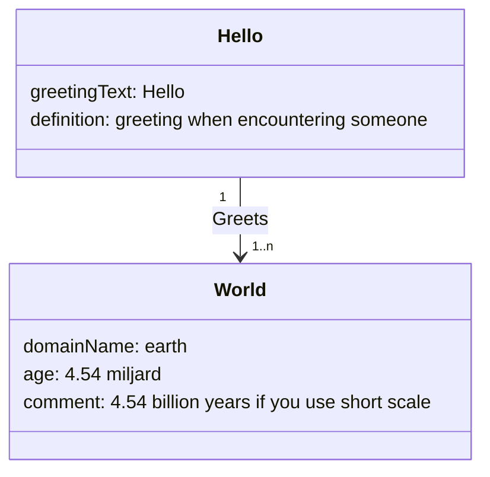

# Use Case Overview of EU Company Certificate

Purpose: Capture the story and high-level purpose of the use case “issuing and using the EUCC”.

> Note: The acronim EUCC is already taken and may couse misunderstandings if used here as well. So some proposals:
> Replacing the word Companny with:
> Business, Enterprise, Firm, Organisation, Entity, Legal Person, Commercial, Registered
>
> Replacing the word Certificate with:
> Attestation, Exerpt, Act, Warrent, Deed, Record, Register, Instrument, Grant
>
> Some candidates:
> - EU Business Excerpt
> - EU Business Warrent
> - EU Organisation Excerpt
> - EU Organisation Warrent

## Storyline

**What is the scenario being solved?**

Member States shall ensure that the registers issue the EU Company Certificates regarding the companies listed in Annexes II and IIB. 

## Business Context / Motivation

**Why is this attestation needed?**

## Stakeholders

When mentioning organisation, every registered Economic Operator is meant.

 - the organisation stated in the EUCC
 - the registry
 - the organisation asking for the EUCC

## Expected Outcome

**What should happen when the attestation is used?**

The EU Company Certificate shall be accepted in all Member States as sufficient evidence, at the time of its issuance, of the incorporation of the company and of the information listed in paragraphs 2 and 3 of this Article, respectively, which is held by the register in which the company is registered.

# Data Model or Knowledge Graph

Purpose: Capture the entities, attributes, and relationships.

The Hello World data model is depicted below. It is a simple model to illustrate the use of data models to capture the use case entities.

Figure 1 "Hello World" exaple diagram or knoledge graph.

**Entity: Hello**
|Name|Description/Definition|
|--|--|
| Hello | Represents the  _Hello_  part of  _Hello World_. It symbolizes the entity initiating a greeting. |

|Attribute| Description | mandatory | private | datatype | 
|--|--|--|--|--|
| greetingText | An example of a mandatory attribute that holds the text of the greeting. | yes | no | string |
| definition | An example of an optional, private attribute describing the greeting or its context. | no | yes | string |

| Relation | Description | Left Entity | Right Entity | Left Role | Right Role | Cardinality | Optional |
|--|--|--|--|--|--|--|--|
| greets | Expresses the relation between Hello (the greeter) and World (the greeted). | Hello | World | greeter | greeted | 1 1..n | no |

> Questions to ask per relation:
> Check whether the direction (Hello ? World) reflects the dominant
> flow of meaning.
> If both sides can have multiple relations (n?n), consider
> refactoring the relationship into a separate class (e.g.,
> GreetingEvent)

**Entity: World**
|Name|Description/Definition|
|--|--|
| World | Represents the  _World_  part of  _Hello World_. It symbolizes the entity initiating a greeting. |

|Attribute| Description | mandatory | private | datatype | 
|--|--|--|--|--|
| domainName | A mandatory attribute representing the domain, context, or scope being greeted. | yes | no | string |
| age | An optional, private attribute showing example metadata about the World. | no | yes | string |

| Relation | Description | Left Entity | Right Entity | Left Role | Right Role | Cardinality | Optional |
|--|--|--|--|--|--|--|--|
| (none) | The World entity has no outgoing relations in this example. | - | - | - | - | - | - |

# Workflow of the Attestation

Purpose: Map the flow of actions, data, and interactions between entities.

| Actor | Role | Description |
|--|--|--|
| Hello Authority | issuer | The trusted party that creates and issues the Hello World attestation. It defines the semantics, attributes, and relation (“greets”) between the entities Hello and World. It also manages issuance, signing, and potential revocation. |
| Wallet Owner | holder | The user (or test persona) who receives the Hello World attestation in their EU Digital Identity Wallet. The holder stores, manages, and can present the attestation when needed. |
| EU business Wallet | Wallet | The technical component used by the holder to receive, store, and present the attestation. It handles workflow and format negotiation (JSON-LD, SD-JWT, mDoc) and enforces binding with the holder’s ID attestation. |
| Verifier | relying party | The entity that requests and verifies the Hello World attestation to confirm the claim “Hello greets World” is valid and trustworthy. It validates the signature, the wallet binding, and the issuer’s trust status. |
| Trust Registry | governance authority | Maintains the trust list or framework under which the Hello World issuer (Hello Authority) is recognized as trustworthy. It ensures that the attestation can be verified across systems and jurisdictions. |
| Attestation Registry | registry | Stores or indexes attestations for verification (if used in your architecture). |
| Revocation Service | revocation service | Manages lifecycle events, such as the deactivation of the Hello World attestation. |

Trigger Event: What initiates the workflow? a request from the holder’s wallet to obtain the “Hello World” attestation from the Hello Authority.

Post-condition: What is the result of the workflow? The holder’s wallet contains an active, verifiable Hello World attestation bound to the ID attestation.

See Figure 2 for a simplified overview.

![Swimlane 1](https://www.plantuml.com/plantuml/png/ZLJDaXet4BxhAReuh6SgIt6VpO-niIjR5SSkMDkLAYvQgHaKX3HfQMP2Ggho3dd3F4ca4R0C2snEZAJkhx_kxsjUEy_9rslDlF8QOV0ZQctXgoKjOUmzXdUlh85___u7tXavz7OOVcB0Qg5jEs3i5RorsX98N2YZOh23H-vGGaZRs9f0QEuSICLBucl6t4gPYeTFuCAhHlaD_Ca0tbYII0bhmcarHHbktrlZJ-_USB4goTP6ffUVLBdqlqJYBVlh2DvOZm7wQiB_Bzo3TgrQQsxm2lE7ED2hbLD8B7GsDy5Uvi29RDiHE8q9cdns-3JUEFfZrWwo0E6JM3aqYiDsBBobBJngArOk07HdLy0Crznu9U23bQYHRY5PP5pxfQM8djqxLoFbuSLg6ICcgbIUQ_ZAjKP_2r-Gr4B5bmUgdOSfbifvsepU1rRO1Y_TXhl6YkIr6LAZ1Dxs3BZFWSnMyOBhdB5jgWYZNIdus1gaBUjSpOe7KcM9L8Jat-g0D3V7_Xu0VyA_2s1zsbjMl5sYM46Re6_cvdu23TTAXgxlc5f0zYMUViZ1Bz50zgs8EXGx7RxVeCiPQeVFNepDMJ55W-tSF252e6qhXaQgHNXEb7VJBWdHkyGxKhsaGI3TSU8UWHB27Ii-4GQziTzlCLEbERwQcnjmw24UQmVVGOVPbNikJYXq7xSz5Fi3zoc4mfASc-m0COuMn3nYd1Cpe7pSgQatGDqjKe_dzMOdg0C-WUgelYZep5l2qwYzEo6RejueKy8dJduJuVSYL8GEpNvCcLt0uBakW_oyYQo9kV0D24BkiGUMn8d7cDkhVoob2rA5YHB23OGB3kkuZ36blr0mWiDATVITrGscwH3u67j9pcJslP9P4cuK8rSeHtFpxlTAKVYQrHMIGuaoFqFvi1Gm_dcoK__gVW0KOo6myZrLBgyDGEZgLnGdyMbfs2iO3eTmr5x5_H8opQEhi47ZynXnrLAfvJxy-Obzhf8uUxFlXdNM1LCKg9f3i5XoK-BTt7m8lKLZI3HncU3Uy6veBnXpLZ-ww4tZGKJT72ouqj1q6MB7ElsVl4OZwxN-3m00)
Figure 2 The swim lane diagram Hello World issuance and revocation.

Notable Interactions / Dependencies: Are there cross-border or cross-domain steps?

# Life Cycle of the Attestation

Purpose: Capture how the attestation evolves over time.

| Stage | Description |
|--|--|
| Creation / Issuance | Who issues it and under what conditions? The Hello Authority (trusted issuing entity). Preconditions: The holder’s wallet is activated and bound to a valid ID. |
| Usage / Presentation | How and where it’s presented? The attestation may be presented to any Verifier who requests proof that the Hello Authority issued a valid greeting (symbolically representing any verifiable claim). The wallet creates a verifiable presentation (potentially with selective disclosure). |
| Update / Renewal | Can it change or expire? The Hello World attestation is static by design - it has no mutable attributes. However, if either the schema changes or the Hello Authority updates its signing keys or trust policy, then a new version of the attestation must be issued. Optionally, an expiry date can be set to force periodic renewal for testing lifecycle behavior. |
| Revocation / Expiry | How is it invalidated or replaced? The Hello World attestation can be revoked by the issuer or automatically expire after a predefined validity period. |
| Archiving / End-of-life Handling | What happens after expiry or revocation? The wallet may retain a cryptographic proof of the attestation (hash or record) for audit or traceability purposes, while marking it as expired or revoked. The issuer may archive metadata (e.g., issuance date, revocation timestamp, format used) for audit trails, compliance testing, or statistical reporting complying to privacy rules. In demonstrative settings, archived attestations can serve as test material for verifying lifecycle management and revocation interoperability. |

# Requirements and Constraints

Purpose: Capture explicit and implicit technical or policy requirements.

## Information requirements

| No. | Requirement | Source | Verification method |
|--|--|--|--|
| I001 |  | Monica & Bart | inspect |

## Legal and Regulatory requirements

From https://eur-lex.europa.eu/legal-content/EN/TXT/PDF/?uri=OJ:L_202500025 follows that: 

| No. | Requirement | Source | Verification method |
|--|--|--|--|
| L001 | Member States shall ensure that the registers issue the EU Company Certificates regarding the companies listed in Annexes II and IIB. The EU Company Certificate shall be accepted in all Member States as sufficient evidence, at the time of its issuance, of the incorporation of the company and of the information listed in paragraphs 2 and 3 of this Article, respectively, which is held by the register in which the company is registered. | Article 16b | review |
| L001 | the EU Company Certificate for the limited liability companies listed in Annex II shall include the following information: | Article 16b | review |
| L002 | for limited liability companies: the **the name or names of the company** | Article 16b | review |
| L003 | for limited liability companies: the **legal form** of the company | Article 16b | review |
| L004 | for limited liability companies: the **registration number** of the company **and the Member State where the company is registered** | Article 16b | review |
| L005 | for limited liability companies: the **EUID** of the company | Article 16b | review |
| L006 | for limited liability companies: the **registered office** of the company  What is this? (an address) The registered office is the address recorded in the commercial register that determines: under which Member State’s company law the company is incorporated; where official communications and legal documents must be served; and, in most cases, where the company is considered to have its  legal domicile (even if it operates elsewhere). It’s the company’s  formal legal seat, not necessarily its operational headquarters or main place of business.| Article 16b | review |
| L007 | for limited liability companies: the **correspondence address** of the company, such as its electronic mail or postal address | Article 16b | review |
| L008 | for limited liability companies: the **date of registration** of the company | Article 16b | review |
| L009 | for limited liability companies: the **amount of the subscribed capital** of the company, if applicable. (an amount and currency | Article 16b | review |
| L010 | for limited liability companies: the **status** of the company, such as when it is closed, struck off the register, wound up, dissolved, undergoing insolvency proceedings, economically active or inactive as defined in national law and where it is recorded in the national register; (ENUM: active, inactive, ...) | Article 16b | review |
| L011 | for limited liability companies: the first names, surnames and date of birth, or equivalent information when that date is not recorded in the national register, of **any persons who** either as a body or as members of any such body **are authorised by the company to represent it** in dealings with third parties and in legal proceedings, and whether those persons may do so alone or are required to act jointly  *(we should talk about this. How deep do we follow the PoA chain? We don't! In the text it clearly states are authorised by the company, that is directly, so it means the shareholders. Also we should have a harmonised list of titles of each country.)* | Article 16b | review |
| L012 | for limited liability companies: where the persons referred to in point (j) are legal persons, the name, the legal form, the EUID or, where the EUID is not applicable, the registration number. | Article 16b | review |
| L013 | for limited liability companies: the object of the company, describing its main activity or activities, which can be expressed using the relevant Statistical Classification of Economic Activities in the European Community (NACE) code, where such code is used for the purposes of the register pursuant to applicable national law, and where the object is recorded in the national register.  (note: because some countries don't use the NACE code, one should be able to enter an other code or string. NACE (SBI in NL, different codes in BE, WZ in DE)) | Article 16b | review |
| L014 | for limited liability companies: the **duration** of the company, where its duration is limited. | Article 16b | review |
| L015 | for limited liability companies: details of the company’s **website** where such details are recorded in the national register. | Article 16b | review |
| L016 | for limited liability companies: the **date of issue of the** company’s **EU Company Certificate**. | Article 16b | review |
| L017 | The EU Company Certificate for partnerships listed in Annex IIB shall include the information referred to in paragraph 2 of this Article, with the exception of points (e), (h) (j) and (k). The following information shall also be included: | Article 16b | review |
| L018 | for partnerships: the **registered office, or equivalent**, of the partnership. | Article 16b | review |
| L019 | for partnerships: the amount of **maximum liability or of the contribution of each limited partner**, where that information is recorded in the national register. | Article 16b | review |
| L020 | for partnerships: the first names, surnames and date of birth, or equivalent information when that date is not recorded in the national register, of **the partners, directors or other statutory representatives, who are authorised to represent the partnership** in dealings with third parties and in legal proceedings, or, if not applicable, information about the nature and scope of the authorisation of the partners, directors or other representatives to represent the partnership and their particulars. | Article 16b | review |
| L021 | for partnerships: where the persons referred to in point (c) (this is L018) are legal persons, the name, the legal form, the EUID or, where the EUID is not applicable, the registration number. | Article 16b | review |
| L022 | for partnerships: where different from points (c) (this is L018 and (d) (this is L019), the first names, surnames and date of birth, or equivalent information when that date is not recorded in the national register, of the general partners, and, in the case of limited partnerships, particulars of the limited partners, where particulars of the latter are made publicly available in the national register. | Article 16b | review |
| L023 | for partnerships: where the persons referred to in point (e) are legal persons, the name, the legal form, the EUID or, where the EUID is not applicable, the registration number. | Article 16b | review |
| L024 | Member States shall ensure that the EU Company Certificate can be obtained from the register upon an application submitted to the register by electronic or by paper means. Member States shall ensure that the electronic version of the EU Company Certificate can also be obtained through the system of interconnection of registers. | Article 16b | review |
| L025 | Member States shall ensure that each company listed in Annex II or Annex IIB can obtain its EU Company Certificate in electronic format free of charge unless it causes serious prejudice to the financing of the national registers. In any case, each company shall be able to obtain its EU Company Certificate free of charge at least once per calendar year. Where a price is charged for obtaining the EU Company Certificate, whether by electronic or by paper means, it shall not exceed the administrative costs thereof, including the costs of development and maintenance of registers. | Article 16b | review |
| L026 | Member States shall ensure that the EU Company Certificate provided by the register in electronic form is authenticated by means of trust services as referred to in Regulation (EU) No 910/2014 in order to guarantee that it has been provided by the register and that its content is a true copy of the information held by the register or that it is consistent with the information contained therein. The EU Company Certificate shall also be compatible with the European Digital Identity Wallet, as provided for in Regulation (EU) 2024/1183. | Article 16b | review |
| L027 | Member States shall ensure that the EU Company Certificate provided by the register in paper form includes the date of issuance, as well as the seal or stamp of the register, or equivalent means of authentication, in order to certify that its content is a true copy of the information held by the register or that it is consistent with the information contained therein, and bears a unique protocol or identification number or similar feature that allows the electronic verification of the origin and authenticity of the document. | Article 16b | review |
| L028 | The Commission shall publish the multilingual template for the EU Company Certificate on the European e-Justice portal (“the portal”) in all official languages of the Union. | Article 16b | review |
| L029 | . | Article 16b | review |
| L030 | . | Article 16b | review |

## Functional requirements
| No. | Requirement | Source | Verification method |
|--|--|--|--|
| F001 | The Hello World attestation shall be capable of being issued to any compliant digital wallet, irrespective of the wallet provider or implementation, provided that the wallet supports at least one of the supported attestation formats (JSON-LD, SD-JWT, or mDoc). The attestation should not rely on wallet-specific extensions or proprietary interfaces that would limit its interoperability. | Bart Bink | test |

## Technical requirements – e.g. security, privacy, performance, usability.
| No. | Requirement | Source | Verification method |
|--|--|--|--|
| T001 | The issuer MUST issue the Hello World attestation as a JSON-LD-based attestation. If the recipient wallet does not support JSON-LD, the issuer MUST fall back to an SD-JWT-based attestation. If the recipient wallet does not support SD-JWT, the issuer MUST issue the attestation as an mDoc. | WEBUILD Semantic Modeling interoperability requirement. | test |

## Operational requirements
| No. | Requirement | Source | Verification method |
|--|--|--|--|
| O001 | The  _Hello World_  attestation shall be automatically reactivated/reissued whenever the user’s associated digital identity attestation is renewed or replaced, in order to maintain a valid binding between the attestation and the user’s active eWallet identity. If the recipient wallet does not support SD-JWT, the issuer MUST issue the attestation as an mDoc. | WEBUILD Semantic Modeling interoperability requirement. | test |

## Governance and trust restrictions
| No. | Requirement | Source | Verification method |
|--|--|--|--|
| G001 | The  _Hello World_  attestation shall be cryptographically bound to both the holder’s eWallet and the holder’s verified identity attestation to ensure authenticity and non-transferability.| General trust mechanism. | review |

## Open Questions / Gaps – For follow-up or design iterations.
| No. | Question | Why |
|--|--|--|
| Q001 | How should the  _Hello World_  attestation’s semantics — including its entities, attributes, and relationships — be aligned with existing vocabularies or ontologies to ensure that other ecosystems or wallet implementations can interpret its meaning consistently?| Where does the authoritative meaning of each attribute come from, and how stable must that be? |
| Q002 | Which core entities and attributes in the  _Hello World_  attestation should be represented as references to existing EU or W3C vocabularies, and which—if any—require the definition of new, domain-specific terms? | **Information model:** _semantic reuse vs. semantic innovation,_ ensuring interoperability while avoiding redundancy.
| Q003 | How can we semantically represent the lifecycle states of the  _Hello World_ attestation (e.g., issued, active, revoked, superseded) so that they are machine-interpretable and consistent across issuers and verifiers? | **Lyfe Cycle:** _Lifecycle concepts are often procedural in code_ but implicit in meaning. Defining them semantically enables automation, policy reasoning, and consistent interpretation across ecosystems (outside of the eWallet ecosystem too). |
| Q004 | What is the most appropriate way to semantically express the binding between the  _Hello World_  attestation, the holder’s identity, and the wallet instance, so that trust can be verified across different infrastructures and trust frameworks? Or is this outside the semantics and part of the meta data in the attestation? | **Trust semantics:** This is about semantic binding—how trust relationships are described and validated, not just cryptographically but meaningfully. It connects the modeling work to governance and policy semantics (who asserts what, on whose behalf, and under which trust framework). |
