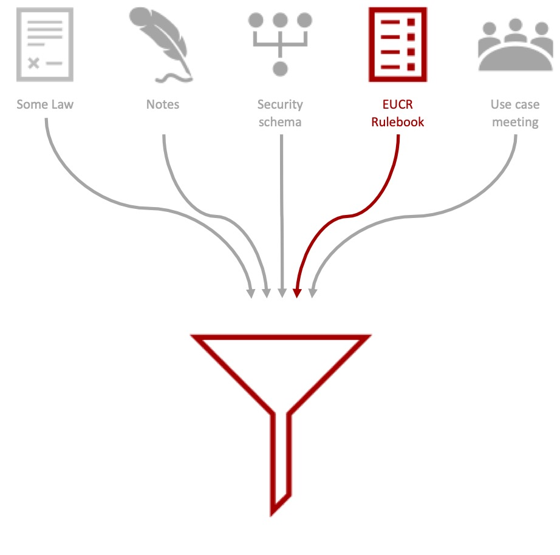

# Use Case Overview of EU Company Registration

Purpose: It is to capture the story and high-level purpose of the use case “presenting proof of registration of the company” as an input for the information model. The information model is the basis for the declaration of Attestation details: Application Model. The mapping will take care of the translation/casting of the Information Model to the Application Model...

This iteration is based on:

 - Rulebook Company Registration Attestation v1.2.pdf

Other sources are yet to be incorporated.

Input: Company law and EUCC Data Rulebook.

> **Important:** This template is on a "need" basis. If there is nothing to mention in the workflow part of the use case, for instance, just omit the paragraph. Only use what you need to. Keep it simple and clean.

## Storyline

**What is the scenario being solved?**

- The attestation proves the registration of the company in the business register of the Member State and provides basic information on the company such as the status of the company, the type of the company, the type of activity of the company and company contact and location details.
- The CR attestation encompasses the company key attributes as stated in the Implementing Regulation 2013/138 on high-value datasets regarding the open data regulation 2019/1024.

## Business Context / Motivation

Why is this attestation needed?

## Stakeholders

When mentioning organisation, every registered Economic Operator is meant.

 - the organisation stated in the EUCR
 - the registry
 - the organisation asking for the EUCR

## Expected Outcome

**What should happen when the attestation is used?**

The EU Company Registration shall be accepted in all Member States as sufficient evidence, at the time of its issuance, of the incorporation of the company, which is held by the register in which the company is registered.

# Information Model or Knowledge Graph

Purpose: Capture the entities, attributes, and relationships.

**Entity: EOCR**
| Name | Description/Definition | vocabulary | required by |
|--|--|--|--|

**Attributes of Entity: EOCR**
|--|--|--|--|--|--|

| Relation | Description | vocabulary | Left Entity | Right Entity | Cardinality | required by |
|--|--|--|--|--|--|--|

> Questions to ask per relation:
> 

# Workflow of the Attestation

Purpose: Map the flow of actions, data, and interactions between entities.

| Actor | Role | Description |
|--|--|--|
Trigger Event: What initiates the workflow?

Post-condition: What is the result of the workflow?

Notable Interactions / Dependencies: 

# Life Cycle of the Attestation

Purpose: Capture how the attestation evolves over time.

| Stage | Description |
|--|--|
| | |

# Requirements and Constraints

Purpose: Capture explicit and implicit technical or policy requirements.

## Legal and Regulatory requirements
| No. | Requirement | Source | Verification method |
|--|--|--|--|

## Information requirements
| No. | Requirement | mandatory/optional |Source | Verification method |
|--|--|--|--|--|
| I001 | Entity for the register in which the organisation is registered | M | [L001](#requirement-L001) | check |

Check for a list of standard legal forms in the EU.

## Functional requirements
| No. | Requirement | Source | Verification method |
|--|--|--|--|
|  |  |  |  |

## Technical requirements – e.g. security, privacy, performance, usability.
| No. | Requirement | Source | Verification method |
|--|--|--|--|
| T001 | paper issuance | [L025](#requirement-L025) |  |

## Rulebook or Operational requirements
| No. | Requirement | Source | MOC | Verification method |
|--|--|--|--|--|
| O001 | Legal entity attribute: company_name. This is the primary name of the company. (string)|  | M | ? |
| O002 | Legal entity attribute: company_type Type of the company based on ISO 20275.  (string)|  | M | ? |
| O003 | Legal entity attribute: company_status . Company status as defined in BRIS.  (string)|  | M | ? |
| O004 | Legal entity attribute: company_activity . The activity of the company, either described as one or more NACE-codes or as one of more descriptions of the activities. (object)|  | M | ? |
| O005 | Legal entity attribute: registration_date . Date of registration of the company. (date)|  | M | ? |
| O006 | Legal entity attribute: company_end_date . The end date of the company. (date)|  | O | ? |
| O007 | Legal entity attribute: company_EUID. Identification of the company. (string)|  | M | ? |
| O008 | Legal entity attribute: vat_number . The VAT (value added taxes) registration number of the company.  (object)|  | O | ? |
| O009 | Legal entity attribute: company_contact_data . The contact information of the company (email address and / or telephone number). (object)|  | O | ? |
| O010 | Legal entity attribute: registered_address . The physical address on which the company is registered. (object)|  | M | ? |
| O011 | Legal entity attribute: postal_address . The physical correspondence address of the company. (object)|  | O | ? |
| O012 | Legal entity attribute: branch. The branch information. (object)|  | O | ? |
| O013 | Company activity attribute: nace_code. The NACE code of the activities of the company. (string)|  | O | ? |
| O014 | Company activity attribute: activity_description. The description of the activities of the company. (string)|  | O | ? |
| O015 | Contact data attribute: email. The main email address of the company. (string)|  | O | ? |
| O016 | Contact data attribute: telephone. The main telephone number of the company. (string) |  | M | ? |
| O017 | Address attribute: po_box. See core location vocabulary. (string)|  | O | ? |
| O018 | Address attribute: thoroughfare. See core location vocabulary. (string)|  | O | ? |
| O019 | Address attribute: location_designator. See core location vocabulary. (string)|  | O | ? |
| O020 | Address attribute: post_code. See core location vocabulary. (string)|  | O | ? |
| O021 | Address attribute: post_name. See core location vocabulary. (string)|  | O | ? |
| O022 | Address attribute: admin_unit_L1. See core location vocabulary. (string)|  | O | ? |
| O023 | Address attribute: admin_unit_L2. See core location vocabulary. (string)|  | O | ? |
| O024 | Branch attribute: branch_name. This is the primary name of the branch of the company. (string)|  | M | ? |
| O025 | Branch attribute: branche_EUID. Identification of the branch of the company. (string)|  | M | ? |
| O026 | Branch attribute: branch_activity. The activity of the branch of the company, either described as one or more NACE-codes or as one of more descriptions of the activities. (company activity object)|  | O| ? |
| O027 | Branch attribute: branch_registered_address. The physical address on which the company is registered. (Address object)|  | M | ? |
| O028 | Branch attribute: branch_postal_address. The physical correspondence address of the company. (Address object)|  | M | ? |
| O029 | Code list company_type: ISO 20275 (e.g: SA, PLC, LLC, GmbH etc)|  | M | ? |
| O030 | Code list company_status: BRIS status list: “closed”, “struck off the register”, “wound up”, “dissolved”, “economically active” or “inactive”. (array)|  | M | ? |
| O031 | Code list company_EUID: identifier of the company following the BRIS-structure: country code + register identifier + registration number + verification digit (optional). |  | M | ? |
| O032 | Intergrety rule: When provided, the attribute “company_end_date” SHALL be greater than the attribute “registration_date” |  | M | ? |

## Governance and trust restrictions
| No. | Requirement | Source | Verification method |
|--|--|--|--|
|  | |  |  |

## Open Questions / Gaps – For follow-up or design iterations.
| No. | Question | Why |
|--|--|--|
|  |  |  |
