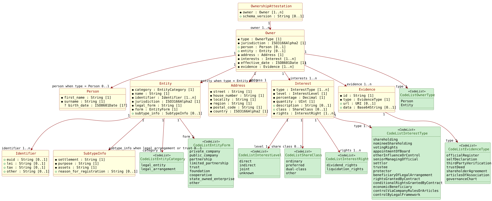

# Semantic Intake: Ownership Attestation

## Introduction

### Purpose

The Ownership Attestation is a digital-wallet attestation that records who holds direct or indirect ownership, economic interest, or control in a legal entity. It is intended to provide a structured, verifiable view of natural persons, legal entities, and legal arrangements that participate in an ownership structure.

### Storyline / Context

The rulebook frames the attestation around the question: who are the shareholders and economic interest holders of this legal entity? The attestation supports multi-tier ownership structures by allowing both natural-person owners and entity owners, including legal arrangements such as trusts or foundations.

### Business Motivation

The attestation supports KYC, KYS, AML compliance, and beneficial ownership transparency. It is designed for automated verification in the EUDI Wallet ecosystem, reducing reliance on unstructured documents while retaining evidence references for the declared ownership or control relationships.

### Stakeholders

The main stakeholders are the legal entity whose ownership is being disclosed, natural-person ultimate beneficial owners, intermediate legal entities, legal arrangements, authorized EAA or QEAA issuers, relying parties performing KYC or KYS checks, and authorities or trust-service providers that support verification and revocation.

### Scope

This intake covers the conceptual semantic model for the Ownership Attestation payload and the requirements that affect that model. SD-JWT VC encoding, status lists, trust anchors, key binding, and issuer authorization are preserved as requirements and metadata decisions, but they are not modeled as core ownership payload classes in the PlantUML diagram.

### Expected Outcome

The semantic model identifies an Ownership Attestation containing one or more Owner entries. Each Owner is either a Person owner or an Entity owner, has an address, at least one interest, an effective date, and at least one evidence record. The model also captures code lists, datatype constraints, conditional legal-arrangement details, and open issues that must be resolved before implementation schemas are produced.

## Intake Metadata

Intake Metadata

| Field | Value |
|--|--|
| Intake name | Ownership Attestation Semantic Intake |
| Domain | Digital-wallet attestations / credentials |
| Scope | Conceptual semantic model |
| Created / updated | 2026-09-16 |
| Existing intake baseline | none |
| Trust / Governance prefix | `G###` |

## Source Register

Source Register

| Source ID | Source | Type | Version / Date | Locator Method | Notes |
|--|--|--|--|--|--|
| SRC001 | rb-ownership.md | MD | Version 1.0, 2026-07-23 | Markdown headings, section numbers, tables, integrity rule IDs, and encoding table rows | Primary Ownership Attestation rulebook source |

## Semantic Model

### Conceptual Summary

The Ownership Attestation payload centers on an `owner` array. Each Owner entry has a discriminator `type` and resolves to either a `person` object or an `entity` object. All Owner entries carry common ownership-context attributes: jurisdiction, address, one or more interest records, an effective date, and one or more evidence records.

Natural-person owners contain name and date-of-birth information. Entity owners contain a category, official name, one or more legal identifiers, jurisdiction, legal form, a controlled entity form, and conditional legal-arrangement details. Interest records express the nature, level, percentage, quantity, class, rights, and description of the ownership or control relationship. Evidence records identify substantiating documents or embedded source data.

The PlantUML diagram is intentionally payload-oriented. Trust regime metadata such as EAA or QEAA category, key binding, trust anchors, JWT issuer claims, and status-list metadata remain traceable in the requirement register, but are outside the core ownership graph unless a later review explicitly chooses to model credential metadata.

### PlantUML Diagram

### Entities

Entities

| Entity ID | Name | Definition | Source Semantic Element(s) | Notes |
|--|--|--|--|--|
| ENT001 | OwnershipAttestation | Credential-level payload container for one or more ownership disclosures. | E001 | Core payload root. |
| ENT002 | Owner | Person, legal entity, or legal arrangement that holds an ownership stake, economic interest, or control relationship. | E002 | Common owner context before resolving to person or entity details. |
| ENT003 | Person | Natural-person owner profile. | E003 | Present when `Owner.type` is `Person`. |
| ENT004 | Entity | Legal-entity or legal-arrangement owner profile. | E004 | Present when `Owner.type` is `Entity`. |
| ENT005 | Identifier | Legal-entity identifier object containing one or more identifier values. | E005 | At least one of euid, lei, tax, or other is required. |
| ENT006 | SubtypeInfo | Legal-arrangement details required for legal arrangements and trusts. | E006 | Conditional object. |
| ENT007 | Address | Residential or registered address for an Owner. | E007 | Residential for Person, registered for Entity. |
| ENT008 | Interest | Ownership, economic, voting, contractual, or control interest held by an Owner. | E008 | One or more per Owner by explanation and integrity rules. |
| ENT009 | Evidence | Evidence item substantiating an Owner entry or ownership relationship. | E009 | One or more per Owner. |
| ENT010 | CodeListOwnerType | Controlled values for Owner type. | E010 | `Person`, `Entity`. |
| ENT011 | CodeListEntityCategory | Controlled values for entity category. | E010 | `legal_entity`, `legal_arrangement`; source also mentions `unknown` in terminology, tracked as a gap. |
| ENT012 | CodeListEntityForm | Controlled values for entity form. | E010 | Section 2.8.6 values. |
| ENT013 | CodeListInterestLevel | Controlled values for how an interest is held. | E010 | Section 2.8.2 values. |
| ENT014 | CodeListShareClass | Controlled values for optional share class. | E010 | Section 2.8.1 values. |
| ENT015 | CodeListInterestRight | Controlled values for economic rights attached to an interest. | E010 | Section 2.8.3 values. |
| ENT016 | CodeListInterestType | Controlled role and interest-type values. | E010 | Section 2.8.5 values. |
| ENT017 | CodeListEvidenceType | Controlled values for evidence type. | E010 | Section 2.8.9 values. |

### Attributes

Attributes

| Attribute ID | Entity | Name | Definition | Mandatory | Datatype | Cardinality | Code List / Pattern | Privacy Classification | Source Semantic Element(s) | Notes |
|--|--|--|--|--|--|--|--|--|--|--|
| ATT001 | ENT001 | owner | One or more owners or interest holders in the subject legal entity. | mandatory | Owner object | 1..n | none | mixed personal and non-personal | E001 | Root payload relation. |
| ATT002 | ENT001 | schema_version | Optional schema version metadata for the attestation. | optional | String | 0..1 | none | credential metadata | E014 | Kept as metadata, not core ownership data. |
| ATT003 | ENT002 | type | Discriminator stating whether this Owner is represented by person or entity details. | mandatory | String enum | 1 | CodeListOwnerType | mixed personal and non-personal | E002, E010 | Drives conditional person and entity relations. |
| ATT004 | ENT002 | jurisdiction | Country of legal relevance for this Owner entry. | mandatory | String | 1 | ISO 3166-1 alpha-2 | mixed personal and non-personal | E002, E011 | Applies to all Owner entries. |
| ATT005 | ENT002 | effective_date | Date when the ownership or control relationship became legally effective. | mandatory | Date string | 1 | ISO 8601 YYYY-MM-DD | non-personal | E002, E011 | Also enforced by IR-21. |
| ATT006 | ENT003 | first_name | First name or names of a natural-person owner. | mandatory | String | 1 | non-empty string | personal | E003 | Present when owner type is Person. |
| ATT007 | ENT003 | surname | Last name or surname of a natural-person owner. | mandatory | String | 1 | non-empty string | personal | E003 | Present when owner type is Person. |
| ATT008 | ENT003 | birth_date | Date of birth of a natural-person owner. | unresolved | Date string | 1 or 0..1 | ISO 8601 YYYY-MM-DD | personal | E003, E011 | Mandatory in explanation, optional in data tree and encoding table. See GAP001. |
| ATT009 | ENT004 | category | Entity classification as legal entity or legal arrangement. | mandatory | String enum | 1 | CodeListEntityCategory | non-personal | E004, E010 | Section 2.8 terminology also uses `unknown`. See GAP002. |
| ATT010 | ENT004 | name | Complete official registered name of the entity or legal arrangement. | mandatory | String | 1 | non-empty string | non-personal | E004 | Entity owner name. |
| ATT011 | ENT004 | jurisdiction | Jurisdiction in which the entity is registered or legally domiciled. | mandatory | String | 1 | ISO 3166-1 alpha-2 | non-personal | E004, E011 | Distinct from Owner jurisdiction but same country-code pattern. |
| ATT012 | ENT004 | legal_form | Legal form text of the entity. | mandatory | String | 1 | none | non-personal | E004 | Rulebook lists this as mandatory. |
| ATT013 | ENT004 | form | Controlled high-level form of the entity. | mandatory | String enum | 1 | CodeListEntityForm | non-personal | E004, E010 | Section 2.8.6 values. |
| ATT014 | ENT005 | euid | European Unique Identifier. | optional | String | 0..1 | EUID pattern unspecified | non-personal | E005 | At least one identifier field must be present. |
| ATT015 | ENT005 | lei | Legal Entity Identifier. | optional | String | 0..1 | ISO 17442 LEI, 20 characters in encoding table | non-personal | E005, E011 | At least one identifier field must be present. |
| ATT016 | ENT005 | tax | National tax or registration number. | optional | String | 0..1 | jurisdiction-specific | non-personal | E005 | At least one identifier field must be present. |
| ATT017 | ENT005 | other | Other applicable legal identifier. | optional | String | 0..1 | none | non-personal | E005 | At least one identifier field must be present. |
| ATT018 | ENT006 | settlement | Instrument or document establishing the legal arrangement. | conditional | String | 1 when subtype_info present | none | non-personal | E006 | Required for legal arrangements and trusts. |
| ATT019 | ENT006 | purpose | Declared purpose of the legal arrangement. | conditional | String | 1 when subtype_info present | none | non-personal | E006 | Required for legal arrangements and trusts. |
| ATT020 | ENT006 | assets | Assets held within the legal arrangement. | conditional | String | 1 when subtype_info present | none | non-personal | E006 | Required for legal arrangements and trusts. |
| ATT021 | ENT006 | reason_for_registration | Optional reason for formal registration. | optional | String | 0..1 | none | non-personal | E006 | Legal-arrangement optional field. |
| ATT022 | ENT007 | street | Street name of the address. | mandatory | String | 1 | non-empty string | mixed personal and non-personal | E007 | Applies to person residential and entity registered addresses. |
| ATT023 | ENT007 | house_number | House or building number. | mandatory | String | 1 | non-empty string | mixed personal and non-personal | E007 | Address component. |
| ATT024 | ENT007 | locality | City or locality. | mandatory | String | 1 | non-empty string | mixed personal and non-personal | E007 | Address component. |
| ATT025 | ENT007 | region | State, province, or region. | mandatory | String | 1 | non-empty string | mixed personal and non-personal | E007 | Address component. |
| ATT026 | ENT007 | postal_code | Postal or ZIP code. | mandatory | String | 1 | non-empty string | mixed personal and non-personal | E007 | Address component. |
| ATT027 | ENT007 | country | Address country. | mandatory | String | 1 | ISO 3166-1 alpha-2 | mixed personal and non-personal | E007, E011 | Applies to all Owner entries. |
| ATT028 | ENT008 | type | One or more role or interest types. | mandatory | Array of strings | 1..n | CodeListInterestType | non-personal | E008, E010 | Array allows concurrent roles. |
| ATT029 | ENT008 | level | Direct, indirect, joint, or unknown holding level. | mandatory | String enum | 1 | CodeListInterestLevel | non-personal | E008, E010 | Describes ownership path level. |
| ATT030 | ENT008 | percentage | Percentage of ownership interest held. | mandatory | Decimal | 1 | 0 through 100 | non-personal | E008, E011 | Sum across owners is constrained by IR-19. |
| ATT031 | ENT008 | quantity | Number of shares or ownership units held. | mandatory | Unsigned integer | 1 | non-negative integer | non-personal | E008, E011 | Required even where control is non-share-based; tracked as GAP008. |
| ATT032 | ENT008 | description | Free-text description of the ownership or control interest. | optional | String | 0..1 | none | non-personal | E008 | Optional interest detail. |
| ATT033 | ENT008 | class | Optional class of shares held. | optional | String enum | 0..1 | CodeListShareClass | non-personal | E008, E010 | Applies when relevant. |
| ATT034 | ENT008 | rights | Economic rights associated with the interest. | mandatory | Array of strings | 1..n | CodeListInterestRight | non-personal | E008, E010 | Section 2.8.3 values. |
| ATT035 | ENT009 | id | Unique identifier, URI, or URN of the source or evidence document. | mandatory | String | 1 | non-empty string, URI, or URN | evidence metadata | E009 | Required for each evidence record. |
| ATT036 | ENT009 | type | Type of evidence document. | mandatory | String enum | 1 | CodeListEvidenceType | evidence metadata | E009, E010 | Section 2.8.9 values. |
| ATT037 | ENT009 | url | URI reference to a publicly accessible source document. | optional | URI string | 0..1 | URI | evidence metadata | E009 | Optional if data is supplied. |
| ATT038 | ENT009 | data | Base64-encoded source document. | conditional | Base64 string | 0..1 | required if url absent or not public | evidence metadata | E009 | Conditional evidence source payload. |

### Relations

Relations

| Relation ID | Name | Definition | Source Entity | Target Entity | Cardinality | Source Semantic Element(s) | Notes |
|--|--|--|--|--|--|--|--|
| REL001 | containsOwner | Ownership Attestation contains one or more Owner entries. | ENT001 | ENT002 | 1..n | E001, E002 | `owner` array is the root payload. |
| REL002 | hasPersonProfile | Owner resolves to a Person profile when type equals Person. | ENT002 | ENT003 | 0..1 conditional | E002, E003 | Entity profile must be absent in this case. |
| REL003 | hasEntityProfile | Owner resolves to an Entity profile when type equals Entity. | ENT002 | ENT004 | 0..1 conditional | E002, E004 | Person profile must be absent in this case. |
| REL004 | hasIdentifier | Entity has one or more identifiers, with at least one identifier value populated. | ENT004 | ENT005 | 1..n | E004, E005 | Source alternates between object and one-or-more wording. See GAP007. |
| REL005 | hasSubtypeInfo | Entity has subtype information when category is legal_arrangement or form is trust. | ENT004 | ENT006 | 0..1 conditional | E004, E006 | Required under the stated conditions. |
| REL006 | hasAddress | Owner has one residential or registered address. | ENT002 | ENT007 | 1 | E002, E007 | Address interpretation depends on owner type. |
| REL007 | hasInterest | Owner has one or more interest records. | ENT002 | ENT008 | 1..n | E002, E008 | Example payload shows a single object, tracked as GAP006. |
| REL008 | hasEvidence | Owner has one or more evidence records. | ENT002 | ENT009 | 1..n | E002, E009 | Evidence substantiates the owner or relationship. |
| REL009 | usesOwnerType | Owner type uses the Owner Type code list. | ENT002 | ENT010 | 1 | E010 | Code-list relation. |
| REL010 | usesEntityCategory | Entity category uses the Entity Category code list. | ENT004 | ENT011 | 1 | E010 | Code-list relation. |
| REL011 | usesEntityForm | Entity form uses the Entity Form code list. | ENT004 | ENT012 | 1 | E010 | Code-list relation. |
| REL012 | usesInterestLevel | Interest level uses the Interest Level code list. | ENT008 | ENT013 | 1 | E010 | Code-list relation. |
| REL013 | usesShareClass | Interest class uses the Share Class code list when present. | ENT008 | ENT014 | 0..1 | E010 | Code-list relation. |
| REL014 | usesInterestRight | Interest rights uses one or more Interest Right code values. | ENT008 | ENT015 | 1..n | E010 | Code-list relation. |
| REL015 | usesInterestType | Interest type uses one or more Interest Type code values. | ENT008 | ENT016 | 1..n | E010 | Code-list relation. |
| REL016 | usesEvidenceType | Evidence type uses the Evidence Type code list. | ENT009 | ENT017 | 1 | E010 | Code-list relation. |

## Open Questions / Gaps

Open Questions / Gaps

| Gap ID | Type | Description | Affected ID(s) | Source Locator(s) | Evidence Quote(s) | Resolution Needed |
|--|--|--|--|--|--|--|
| GAP001 | conflict | `person.birth_date` is optional in the data tree and encoding table, but mandatory in the explanation and mandatory attributes table. | ATT008, E003, I003 | SRC001 section 2.1; SRC001 section 2.2; SRC001 section 2.3; SRC001 section 3.2.1 | "birth_date SHALL be present"; "ISO 8601 YYYY-MM-DD - optional" | Confirm whether birth date is mandatory, optional, or jurisdiction-dependent. |
| GAP002 | code-list | Entity terminology introduces `entity.category: unknown`, but the model and encoding restrict category to `legal_entity` or `legal_arrangement`. | ATT009, ENT011, E010 | SRC001 section 2.1; SRC001 entity classification terms | "category SHALL be one of legal_entity or legal_arrangement"; "entity.category: unknown" | Decide whether `unknown` is an allowed category, a mapping term, or invalid. |
| GAP003 | ambiguity | Mandatory metadata text refers to the AuthorisedSignatories Attestation and only EAA, while the ownership classification and encoding table refer to EAA and QEAA. | E014, G001 | SRC001 section 2.1; SRC001 section 2.5; SRC001 section 3.2.1 | "AuthorisedSignatories Attestation"; "One of EAA or QEAA" | Correct copied wording and define the legal-category rule for ownership. |
| GAP004 | ambiguity | Status-list rules are conditional in SD-JWT VC encoding but revocation wording says every issued CompanyInfo attestation must populate metadata status_list. | E013, T004, G004 | SRC001 section 3.2.2; SRC001 section 6.1 | "if the technical validity period is greater than 24 hours"; "every issued CompanyInfo attestation" | Confirm whether status is conditional or always required and correct copied attestation name. |
| GAP005 | missing-source | Relying-party integrity and policy validation rules are deferred to a future version. | F004, O004 | SRC001 section 4.2.9 | "will be specified in a future version" | Add concrete relying-party validation rules or mark them explicitly out of scope. |
| GAP006 | cardinality | The rulebook says each Owner has at least one interests record, but the non-normative example encodes `interests` as an object instead of an array. | ATT028, REL007, E008 | SRC001 section 2.1; SRC001 section 3.2.3 | "at least one interests record"; "`interests`: {" | Decide whether interests is an array or a singleton object with array-valued type and rights. |
| GAP007 | modelling | Entity identifiers are described as one-or-more identifiers, but the tree and encoding table represent `identifier` as one object with optional fields. | ATT014, ATT015, ATT016, ATT017, REL004, E005 | SRC001 section 2.1; SRC001 section 3.2.1 | "identifier [1..n]"; "at least one identifier field SHALL be present" | Clarify whether Identifier repeats or is a single object with multiple optional identifier fields. |
| GAP008 | modelling | Percentage and quantity are mandatory for every interest, including non-shareholding or control roles where a number of shares may not apply. | ATT030, ATT031, E008 | SRC001 section 2.1; SRC001 section 2.8.5 | "quantity - non-negative integer"; "other significant influence or control" | Define whether zero or null-like values are allowed for non-share-based control. |
| GAP009 | missing-source | The terminology defines Legal Entity Identifier Chain, but the payload has no explicit ownership-chain path or intermediate-link relation. | REL007, E008 | SRC001 section 1.4; SRC001 section 2.1 | "list of all intermediate legal entities"; "interests.level: indirect" | Decide whether indirect ownership path details require a relation or are out of scope. |
| GAP010 | code-list | Ownership Controller Category Codes are defined but are not referenced by the payload, integrity rules, or encoding table. | E010 | SRC001 section 2.8.4; SRC001 section 2.8.5 | "Ownership Controller Category Codes"; "`interests.type` Values" | Decide whether section 2.8.4 should be mapped to `interests.type`, added as a new attribute, or removed. |

### Conceptual Review Remarks

The rulebook provides a strong conceptual basis for the core ownership payload. The main modelling decisions still needed are around optional versus mandatory birth date, singleton versus repeated `interests` and `identifier` structures, and whether indirect ownership paths need explicit intermediate-link modeling. The current PlantUML diagram follows the stricter conceptual reading where Owners have one or more Interest and Evidence objects, while preserving unresolved source ambiguity in gaps.

## Requirement Register

### Operational Requirements

Operational Requirements

| ID | Requirement | Kind | Immediate Predecessor(s) | Source Locator(s) | Evidence Quote(s) | Derivation / Notes | Status |
|--|--|--|--|--|--|--|--|
| O001 | The Ownership Attestation shall answer who holds shareholder or economic-interest positions in a legal entity. | direct | SRC001 section 1 | SRC001 section 1 | "Who are the Shareholders and Economic Interest Holders of this legal entity?" | Captures the rulebook's central business question. | active |
| O002 | The attestation shall support KYC, KYS, AML, regulatory compliance, and beneficial ownership transparency. | direct | SRC001 section 1.1 | SRC001 section 1.1 | "critical component of both Know Your Customer and Know Your Supplier processes" | Scope and motivation requirement. | active |
| O003 | The attestation shall support EAA self-issuance and QEAA issuance by qualified or authorized bodies. | direct | SRC001 section 2.1; SRC001 section 4.1 | SRC001 section 2.1; SRC001 section 4.1 | "MAY be classified as EAA"; "QEAA when issued by a qualified trust service provider" | Trust regime is operational and governance context. | active |
| O004 | Relying parties shall perform base attestation verification and future ownership integrity or policy checks. | direct | SRC001 section 4.2; SRC001 section 4.2.9 | SRC001 section 4.2; SRC001 section 4.2.9 | "Relying Party SHALL perform"; "will be specified in a future version" | Verification details are partly deferred. | unresolved |

### Functional Requirements

Functional Requirements

| ID | Requirement | Kind | Immediate Predecessor(s) | Source Locator(s) | Evidence Quote(s) | Derivation / Notes | Status |
|--|--|--|--|--|--|--|--|
| F001 | The attestation shall provide a complete, verifiable representation of ownership structure in a standardized digital format. | direct | SRC001 section 2 | SRC001 section 2 | "complete, verifiable representation of an entity's ownership structure" | Establishes payload completeness objective. | active |
| F002 | The attestation shall support natural persons, legal entities, and legal arrangements as owner types or owner subtypes. | direct | SRC001 section 2.1 | SRC001 section 2.1 | "natural persons, legal entities, and legal arrangements" | Drives person/entity split and legal-arrangement subtype. | active |
| F003 | The attestation shall support multi-tier ownership structures and indirect ownership. | direct | SRC001 section 1.1; SRC001 section 2 | SRC001 section 1.1; SRC001 section 2 | "complex, multi-tiered corporate structures" | Drives interest level and possible chain gap. | active |
| F004 | The attestation shall be selectively disclosable for top-level owner claims in SD-JWT VC form. | direct | SRC001 section 3.2 | SRC001 section 3.2 | "Top-level claims owner SHALL be individually selectively disclosable" | Encoding behavior, not a core payload class. | active |

### Information Requirements

Information Requirements

| ID | Requirement | Kind | Immediate Predecessor(s) | Source Locator(s) | Evidence Quote(s) | Derivation / Notes | Status |
|--|--|--|--|--|--|--|--|
| I001 | The payload shall contain an `owner` collection with at least one Owner entry. | direct | SRC001 section 2.1; SRC001 IR-01 | SRC001 section 2.1; SRC001 section 2.9 IR-01 | "Owner [1..n]"; "owner array SHALL contain at least one entry" | Root payload information need. | active |
| I002 | Each Owner shall include type, jurisdiction, address, interests, effective_date, and evidence. | direct | SRC001 section 2.1 | SRC001 section 2.1 | "Each Owner entry SHALL include" | Common Owner data requirement. | active |
| I003 | A Person owner shall carry first_name, surname, and birth_date information, subject to unresolved birth-date optionality. | direct | SRC001 section 2.1; SRC001 section 2.2; SRC001 section 3.2.1 | SRC001 section 2.1; SRC001 section 2.2; SRC001 section 3.2.1 | "first_name and surname SHALL be present"; "birth_date SHALL be present" | Birth-date conflict tracked as GAP001. | unresolved |
| I004 | An Entity owner shall carry category, name, identifier, jurisdiction, legal_form, and form. | direct | SRC001 section 2.1; SRC001 section 2.2 | SRC001 section 2.1; SRC001 section 2.2 | "category SHALL be present"; "identifier SHALL contain at least one" | Entity profile information need. | active |
| I005 | Entity identifier information shall support euid, lei, tax, and other identifier values, with at least one present. | direct | SRC001 section 2.1; SRC001 IR-06 | SRC001 section 2.1; SRC001 section 2.9 IR-06 | "At least one identifier required"; "at least one of: euid, lei, tax, or other" | Identifier repetition ambiguity tracked as GAP007. | active |
| I006 | Legal arrangements and trusts shall include subtype_info with settlement, purpose, and assets, and may include reason_for_registration. | direct | SRC001 section 2.1; SRC001 section 2.4; SRC001 IR-05 | SRC001 section 2.1; SRC001 section 2.4; SRC001 section 2.9 IR-05 | "subtype_info object SHALL be present" | Conditional legal-arrangement information. | active |
| I007 | Each Owner shall include an address with street, house_number, locality, region, postal_code, and country. | direct | SRC001 section 2.1; SRC001 section 2.2 | SRC001 section 2.1; SRC001 section 2.2 | "Address Mandatory Attributes applies to all Owner entries" | Address model information need. | active |
| I008 | Each Owner shall include at least one interests record with type, level, percentage, quantity, rights, and optional description and class. | direct | SRC001 section 2.1; SRC001 section 2.2 | SRC001 section 2.1; SRC001 section 2.2 | "At least one interests record"; "interests.class optional" | Interest model information need. | active |
| I009 | Each Owner shall include at least one evidence entry with id and type, and optional or conditional url and data. | direct | SRC001 section 2.1; SRC001 section 2.4; SRC001 IR-13 through IR-16 | SRC001 section 2.1; SRC001 section 2.4; SRC001 section 2.9 IR-13 through IR-16 | "Each Owner entry SHALL include at least one evidence entry" | Evidence model information need. | active |
| I010 | The model shall preserve controlled value lists for owner type, entity category, entity form, interest type, interest level, rights, share class, and evidence type. | direct | SRC001 section 2.8 | SRC001 section 2.8 | "Value Lists" | Code-list information need. | active |
| I011 | The model shall preserve datatype and format constraints for dates, country codes, decimals, unsigned integers, URI values, and base64 evidence data. | direct | SRC001 section 2.1; SRC001 section 2.8.7; SRC001 section 2.8.8 | SRC001 section 2.1; SRC001 section 2.8.7; SRC001 section 2.8.8 | "ISO 3166-1 alpha-2"; "ISO 8601 YYYY-MM-DD" | Constraint information need. | active |
| I012 | Integrity constraints shall cover owner presence, natural-person presence, conditional object exclusivity, legal-arrangement subtype details, identifiers, interests, evidence, dates, country codes, percentage sum, entity form, and effective date. | direct | SRC001 section 2.9 | SRC001 section 2.9 | "The following integrity rules SHALL be enforced" | Summarizes IR-01 through IR-21. | active |
| I013 | SD-JWT VC encoding shall identify the credential type as `eu.we-build:ownership:1` and conditionally include a status claim when validity exceeds 24 hours. | direct | SRC001 section 3.2; SRC001 section 3.2.2 | SRC001 section 3.2; SRC001 section 3.2.2 | "Verifiable Credential Type"; "if the technical validity period is greater than 24 hours" | Technical metadata information need. | active |
| I014 | Trust, key-binding, issuer, legal-category, and trust-anchor metadata shall be retained as credential metadata outside the core payload model. | direct | SRC001 section 2.5; SRC001 section 2.6; SRC001 section 3.2.1; SRC001 chapter 5 | SRC001 section 2.5; SRC001 section 2.6; SRC001 section 3.2.1; SRC001 chapter 5 | "cnf cryptographic Key Binding"; "trust_anchor_url" | Skill directs trust regime metadata outside core diagram. | active |

### Semantic Element Requirements

Semantic Element Requirements

| ID | Requirement | Kind | Immediate Predecessor(s) | Source Locator(s) | Evidence Quote(s) | Derivation / Notes | Status |
|--|--|--|--|--|--|--|--|
| E001 | Model `OwnershipAttestation` as the payload root containing `owner` with cardinality 1..n. | modeling | I001 | SRC001 section 2.1; SRC001 section 2.9 IR-01 | "Owner [1..n]" | Conceptual root derived from owner collection. | active |
| E002 | Model `Owner` as the common owner record with type, jurisdiction, address, interests, effective_date, and evidence. | modeling | I002 | SRC001 section 2.1 | "Each Owner entry SHALL include" | Common attributes apply before Person or Entity specialization. | active |
| E003 | Model `Person` as the natural-person profile conditionally present when Owner type is Person. | modeling | I003 | SRC001 section 2.1; SRC001 IR-03 | "person object SHALL be present" | Birth-date optionality remains unresolved. | unresolved |
| E004 | Model `Entity` as the legal-entity or legal-arrangement profile conditionally present when Owner type is Entity. | modeling | I004 | SRC001 section 2.1; SRC001 IR-04 | "entity object SHALL be present" | Covers legal entities and legal arrangements. | active |
| E005 | Model `Identifier` for entity identifier fields euid, lei, tax, and other. | modeling | I005 | SRC001 section 2.1; SRC001 IR-06 | "identifier SHALL contain at least one" | Repetition ambiguity remains tracked as GAP007. | active |
| E006 | Model `SubtypeInfo` for conditional legal-arrangement and trust details. | modeling | I006 | SRC001 section 2.4; SRC001 IR-05 | "settlement, purpose, and assets SHALL all be populated" | Conditional entity child object. | active |
| E007 | Model `Address` as a shared address object for Owner entries. | modeling | I007 | SRC001 section 2.1; SRC001 section 2.2 | "Address Mandatory Attributes applies to all Owner entries" | Shared person/entity address object. | active |
| E008 | Model `Interest` as an ownership or control relationship record with controlled type, level, rights, optional class, quantity, percentage, and description. | modeling | I008 | SRC001 section 2.1; SRC001 section 2.8.5 | "interests.type SHALL be an array" | Singleton versus array ambiguity remains tracked as GAP006. | active |
| E009 | Model `Evidence` as a repeatable substantiation object with id, type, url, and conditional data. | modeling | I009 | SRC001 section 2.1; SRC001 IR-13 through IR-16 | "Each Owner entry SHALL include at least one evidence entry" | Evidence object supports document references or embedded data. | active |
| E010 | Model explicit code-list classes for owner type, entity category, entity form, interest type, interest level, share class, interest rights, and evidence type. | modeling | I010 | SRC001 section 2.8 | "Value Lists" | Ownership Controller Category Codes are tracked separately as GAP010. | active |
| E011 | Attach datatype and format constraints to relevant attributes rather than introducing implementation schemas. | modeling | I011 | SRC001 section 2.8.7; SRC001 section 2.8.8 | "SHALL use ISO 3166-1 alpha-2"; "SHALL follow ISO 8601" | Conceptual model records constraints without JSON Schema. | active |
| E012 | Preserve integrity rules as validation requirements linked to entities and attributes. | modeling | I012 | SRC001 section 2.9 | "Integrity Rules" | Rules are traceability requirements, not separate diagram classes. | active |
| E013 | Keep status-list details as credential metadata outside the core ownership payload diagram unless explicitly modeled later. | modeling | I013 | SRC001 section 3.2.2 | "status claim SHALL be a JSON object" | Follows payload-oriented diagram guidance. | active |
| E014 | Keep EAA, QEAA, key-binding, issuer, and trust-anchor details as trust and technical metadata outside the core payload diagram. | modeling | I014 | SRC001 section 2.5; SRC001 chapter 5 | "trust anchor mechanisms"; "cnf cryptographic Key Binding" | Follows skill instruction for trust regime metadata. | active |

### Security Requirements

Security Requirements

| ID | Requirement | Kind | Immediate Predecessor(s) | Source Locator(s) | Evidence Quote(s) | Derivation / Notes | Status |
|--|--|--|--|--|--|--|--|
| S001 | The attestation shall include cryptographic key-binding metadata. | direct | SRC001 section 2.5; SRC001 section 3.2.1 | SRC001 section 2.5; SRC001 section 3.2.1 | "cnf cryptographic Key Binding" | Security metadata kept outside payload diagram. | active |
| S002 | The issuer or authorized authority shall be the only party allowed to modify the status-list entry. | direct | SRC001 section 6.1 | SRC001 section 6.1 | "Only the authorized issuer ... may modify the status list entry" | Revocation authority control. | active |

### Technical Requirements

Technical Requirements

| ID | Requirement | Kind | Immediate Predecessor(s) | Source Locator(s) | Evidence Quote(s) | Derivation / Notes | Status |
|--|--|--|--|--|--|--|--|
| T001 | The attestation shall use SD-JWT VC encoding for selective disclosure of ownership structure attributes. | direct | SRC001 section 3.2 | SRC001 section 3.2 | "uses the SD-JWT VC format" | Encoding requirement. | active |
| T002 | The SD-JWT VC credential type shall be `eu.we-build:ownership:1`. | direct | SRC001 section 3.2 | SRC001 section 3.2 | "eu.we-build:ownership:1" | Technical identifier requirement. | active |
| T003 | ISO/IEC 18013-5 mdoc encoding is out of scope for this rulebook. | direct | SRC001 section 3.1 | SRC001 section 3.1 | "mdoc is out of scope" | Also notes copied "Control Attestation" wording. | active |
| T004 | A status claim shall be included when the SD-JWT VC technical validity period exceeds 24 hours. | direct | SRC001 section 3.2.2 | SRC001 section 3.2.2 | "if the technical validity period is greater than 24 hours" | Status-vs-revocation inconsistency tracked as GAP004. | active |

### Legal / Regulatory Requirements

Legal / Regulatory Requirements

| ID | Requirement | Kind | Immediate Predecessor(s) | Source Locator(s) | Evidence Quote(s) | Derivation / Notes | Status |
|--|--|--|--|--|--|--|--|
| L001 | The rulebook shall align ownership transparency with AMLR 2024/1624, relevant RTS, EUDI Wallet, eIDAS 2, and BODS vocabulary. | direct | SRC001 section 1.1 | SRC001 section 1.1 | "AMLR 2024/1624 as the primary regulatory driver" | Legal background driver. | active |
| L002 | At least one natural-person Owner shall be present to satisfy AML beneficial-owner identification expectations. | direct | SRC001 section 2.1; SRC001 IR-02 | SRC001 section 2.1; SRC001 section 2.9 IR-02 | "At least one Owner entry SHALL be of type Person" | Legal/compliance rule with direct semantic impact through I012. | active |

### Trust / Governance Requirements

Trust / Governance Requirements

| ID | Requirement | Kind | Immediate Predecessor(s) | Source Locator(s) | Evidence Quote(s) | Derivation / Notes | Status |
|--|--|--|--|--|--|--|--|
| G001 | EAA trust shall be anchored in the EBWOID cryptographic chain and issuer identity. | direct | SRC001 section 5.2 | SRC001 section 5.2 | "trust is established through a cryptographic chain" | EAA trust-anchor requirement. | active |
| G002 | QEAA trust shall be established through X.509 PKI and the applicable Trust List of Licensees. | direct | SRC001 section 5.1 | SRC001 section 5.1 | "trust is established through the X.509 Public Key Infrastructure" | QEAA trust-anchor requirement. | active |
| G003 | Issuers shall revoke or update attestations when underlying ownership information changes or becomes inaccurate. | direct | SRC001 section 4.1; SRC001 section 6.2 | SRC001 section 4.1; SRC001 section 6.2 | "must immediately revoke the attestation if any change occurs" | Applies differently to EAA and QEAA issuance. | active |
| G004 | Relying parties shall treat revoked or suspended attestations as invalid for credential-validity purposes. | direct | SRC001 section 6.2 | SRC001 section 6.2 | "must be treated as invalid" | Business interpretation remains relying-party policy. | active |

## Validation Summary

Validation Summary

| Check | Result | Notes |
|--|--|--|
| Skill used | Passed | Used installed skill at `/Users/bartbink/.codex/skills/attestation-requirement-extraction/SKILL.md`. |
| Source baseline | Passed | Clean intake created from `rb-ownership.md`; archived Ownership intake files were not used as the baseline. |
| Local PlantUML source | Passed | `Semantic_Intake_Ownership_Attestation.puml` created beside the intake. |
| Local SVG diagram | Passed | `Semantic_Intake_Ownership_Attestation.svg` generated from the local PlantUML source. |
| Validator | Passed | `validate_semantic_intake.py` passed with 0 warnings. |

