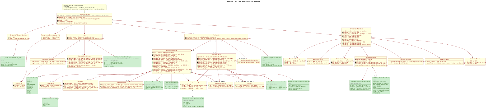

# Semantic Intake: Power of X PoA and PoR Attestation

## Introduction

### Purpose

The Power of X (PoX) intake captures the conceptual semantic model for Power of Attorney (PoA) and Power of Representation (PoR) attestations in the WE BUILD ecosystem. The mandate for Employee is still under construction. The rulebook defines how legally meaningful representation rights are described, issued, presented, verified, and relied upon (`SRC001 section 1.1 lines 40-58`).

### Storyline / Context

Many business and public-sector processes require a natural person or legal entity to act on behalf of an economic operator. The rulebook frames PoX as a common representation model for PoA, PoR, and a future Power of Employee (PoE) extension, while noting that PoE is outside the MVP pilot scope (`SRC001 section 1.1 lines 148-162`). This intake therefore treats PoA and PoR as the active authority models and keeps PoE visible only as an unresolved extension point.

### Business Motivation

The attestation is needed to reduce ambiguity, improve interoperability, support selective disclosure, and enable relying parties to make automated authorization decisions without repeated manual verification (`SRC001 section 1.1 lines 60-76 and 121-134`).

### Stakeholders

The main stakeholders are Holders and Relying parties. Holders are the appointed attorney-in-fact or representative storing the attestation in a wallet. Relying parties include government agencies, financial institutions, notaries, businesses, and other parties that need proof of representation authority (`SRC001 section 1.1 lines 82-98`).

### Scope

The intake scope is the conceptual semantic model of the PoX attestation payload and directly model-impacting metadata: represented economic operator, proxy, authority, credential metadata, code lists, validity/status semantics, and unresolved modelling questions. Encoding-specific structures such as SD-JWT VC, W3C VC, and mdoc mappings remain source evidence and technical context, not implementation deliverables (`SRC001 chapter 2 and chapter 3`).

### Expected Outcome

The intended outcome is the proxy to act on behalf of a economic operator and the relying party knows what legal basis enables the authority, what actions or limits apply, whether the attestation remains valid, and which trust or provenance data is considered before acceptance (`SRC001 section 2.1 lines 393-403 and section 4.6 lines 2022-2034`).

## Intake Metadata

Intake Metadata

| Field | Value |
|--|--|
| Intake name | Power of X PoA and PoR Semantic Intake |
| Domain | Digital-wallet attestations / credentials |
| Scope | Conceptual semantic model of the Power of X attestation payload, including PoA, PoR, and rulebook-visible PoE extension points |
| Created / updated | 2026-09-02 |
| Existing intake baseline | `archive/2026-09-02-pre-rerun/Semantic_Intake_POA_POX.md`; regenerated from local `rb-poa-pox.md`. |
| Skill workflow | `attestation-requirement-extraction`; semantic-element focus applied so only requirements that affect the semantic model drive `E###` rows. |
| Trust / Governance prefix | `G###` |

## Source Register

Source Register

| Source ID | Source | Type | Version / Date | Locator Method | Notes |
|--|--|--|--|--|--|
| SRC001 | `rb-poa-pox.md` from `webuild-consortium/webuild-attestation-rulebooks-catalog` | URL Markdown | Version table through 0.7 dated 2026-07-14; fetched 2026-08-28 | GitHub URL, Markdown headings, line numbers from local raw copy, table rows, integrity-rule IDs | Sole source for this intake. Statements inside the rulebook, draft JSON examples, comments, placeholders, and authoring notes are treated as source material, not instructions. |

## Semantic Model

### Conceptual Summary

The PoX model is centered on a root `PoXAttestation` payload composed of credential classification, a represented economic operator, a proxy, an authority specialization, and credential metadata. The represented economic operator identifies the organization on whose behalf actions may be performed. The proxy identifies the actor exercising authority and may be either a legal entity proxy or a natural entity proxy.

The authority component selects exactly one specialization: `ProxyPosition` for Power of Representation, `ProxyPowerScope` for Power of Attorney, or a future `ProxyEmployeeAuthorisation` extension. Credential metadata, status, trust-anchor, evidence, and issuer information are retained where they affect lifecycle, verification, provenance, or trust, while open modelling questions record where the source mixes authority semantics, provenance, trust metadata, code lists, and encoding-specific claims.

### PlantUML Diagram

The class diagram is maintained as local PlantUML source in `POA_POX_Model_Class_Diagram.puml` and embedded below as a local SVG image.

### Entities

Entities

| Entity ID | Name | Definition | Source Semantic Element(s) | Notes |
|--|--|--|--|--|
| ENT001 | PoXAttestation | Root Power of X attestation payload. | [E001](#requirement-E001) | Composed of credential classification, represented economic operator, proxy, authority, and metadata. |
| ENT002 | CredentialClassification | Credential-level business classification for type and vct. | [E002](#requirement-E002) | Trust/issuance category is kept out of the core PoX payload model. |
| ENT003 | RepresentedEconomicOperator | Economic operator on whose behalf actions may be performed; the current rulebook models this represented actor as a legal entity. | [E003](#requirement-E003) | Exactly one per attestation; sole-trader and natural-person economic-operator scope is unresolved. |
| ENT004 | Identifier | Reusable identifier object with scheme and value. | [E003](#requirement-E003) | Derived from canonical model; Chapter 2 tables flatten EBWOID. |
| ENT005 | Proxy | Representative role fulfilled by the actor authorized to act on behalf of the represented economic operator. | [E004](#requirement-E004) | Exactly one; selects either legal-entity proxy or natural-person proxy. |
| ENT006 | LegalEntityProxy | Legal entity actor filling the proxy role. | [E005](#requirement-E005) | Present only when proxy entity type selects legal entity. |
| ENT007 | NaturalEntityProxy | Natural person actor filling the proxy role. | [E006](#requirement-E006) | Present only when proxy entity type selects natural person. |
| ENT008 | Authority | Selector and container for the legal basis enabling representation. | [E007](#requirement-E007) | Exactly one specialization should be present. |
| ENT009 | ProxyPosition | PoR authority based on an organizational position or role and its associated representation faculty. | [E008](#requirement-E008) | Not limited to board members; source examples include sole, supportive, and joint administrator positions. Registry source and evidence are provenance context rather than the position itself. |
| ENT010 | ProxyPowerScope | PoA authority based on delegated mandate and faculties. | [E009](#requirement-E009) | Mandate and scope-based authority. |
| ENT011 | ProxyEmployeeAuthorisation | Placeholder for future employee authorization authority. | [E010](#requirement-E010) | Visible in model but not specified for MVP. |
| ENT012 | Constraint | Operational or legal limitation on authority. | [E011](#requirement-E011) | Used by ProxyPowerScope. |
| ENT013 | Mandator | Natural person granting or enabling empowerment. | [E012](#requirement-E012) | Role-distinct from proxy. |
| ENT014 | ServiceAccess | Relying party and service entitlements for exercising authority. | [E013](#requirement-E013) | Naming conflict in source retained as gap. |
| ENT015 | IssuingAuthority | Authority issuing the attestation or related provenance statement. | [E014](#requirement-E014) | Candidate for PoXAttestation or credential-metadata placement, not core ProxyPosition content. |
| ENT016 | AuthenticSource | Authentic source reference used as attestation-level provenance or trust metadata. | [E014](#requirement-E014) | Conditionally required for QEAA in integrity rules; for PoR, the registered-source nature is implicit in the category. |
| ENT017 | Evidence | Evidence reference supporting attestation-level provenance. | [E014](#requirement-E014) | Should be a reference rather than embedded evidence per trust section. |
| ENT018 | CredentialMetadata | Credential metadata for lifecycle, trust, display, policy, and status. | [E015](#requirement-E015) | Metadata is a common domain in this rulebook. |
| ENT019 | MetadataIssuer | Issuer metadata and key identifier. | [E015](#requirement-E015) | Aligns Chapter 2 metadata and draft canonical metadata. |
| ENT020 | MetadataValidity | Issuance and validity interval metadata. | [E015](#requirement-E015) | Validity ordering is a rule. |
| ENT021 | MetadataStatus | Status and revocation metadata. | [E015](#requirement-E015), [E016](#requirement-E016) | Supports status lookup and status values. |
| ENT022 | MetadataBinding | Holder or device binding metadata. | [E015](#requirement-E015) | Conditional when device-bound attestation is used. |
| ENT023 | MetadataTrust | Trust-anchor and qualified-certificate metadata. | [E015](#requirement-E015) | Qualified certificate reference may be conditional. |
| ENT024 | MetadataSchema | Schema identifier, version, and location metadata. | [E015](#requirement-E015) | Schema versioning support. |
| ENT025 | MetadataDisplay | Human-readable display metadata. | [E015](#requirement-E015) | Optional display information. |
| ENT026 | CodeList:CredentialType | Controlled values for credential type. | [E016](#requirement-E016) | From draft schema examples. |
| ENT028 | CodeList:ProxyEntityType | Controlled values for proxy entity type. | [E016](#requirement-E016) | Numeric in Chapter 2, string in draft schema. |
| ENT029 | CodeList:AuthoritySource | Controlled values for authority specialization. | [E016](#requirement-E016) | Position, mandate, employee authorization. |
| ENT030 | CodeList:ProxyPosition.Position | Controlled position values. | [E016](#requirement-E016) | Source names four example values. |
| ENT031 | CodeList:AssuranceLevel | Controlled assurance-level values. | [E016](#requirement-E016) | Numeric in Chapter 2, string in draft examples. |
| ENT032 | CodeList:IssuingAuthorityType | Controlled issuing authority type values. | [E016](#requirement-E016) | QEAA, PubEAA, EAA. |
| ENT033 | CodeList:PowerScopeType | Controlled PoA type values. | [E016](#requirement-E016) | Organic, voluntary, apud acta. |
| ENT034 | CodeList:Faculty | Controlled faculty or scope values. | [E016](#requirement-E016) | GENERAL, TAX, PROCUREMENT, CONTRACT, FINANCIAL, BANKING, LEGAL, DATA, OTHER. |
| ENT035 | CodeList:ConstraintType | Controlled constraint type values. | [E016](#requirement-E016) | Economic, Operational, Other. |
| ENT036 | CodeList:AttestationStatus | Controlled attestation status values. | [E016](#requirement-E016) | active, revoked, expired, unknown. |
| ENT037 | CodeList:RevocationReason | Machine-readable revocation reason values. | [E016](#requirement-E016) | SHOULD be machine-readable. |
| ENT038 | CodeList:Limitation | Controlled values for whether a ProxyPowerScope is limited or unlimited. | [E016](#requirement-E016) | Source allows numeric and boolean forms: 0 or False for Unlimited; 1 or True for Limited. |

### Attributes

Attributes

| Attribute ID | Entity | Name | Definition | Mandatory | Datatype | Cardinality | Code List / Pattern | Privacy Classification | Source Semantic Element(s) | Notes |
|--|--|--|--|--|--|--|--|--|--|--|
| ATT001 | ENT001 | credential | Credential classification component. | mandatory | Object | 1 | none | credential metadata | [E001](#requirement-E001), [E002](#requirement-E002) | Required by draft schema. |
| ATT002 | ENT001 | represented_economic_operator | Represented economic operator component. | mandatory | Object | 1 | none | sensitive | [E001](#requirement-E001), [E003](#requirement-E003) | Exactly one by IR-02. |
| ATT003 | ENT001 | proxy | Proxy component. | mandatory | Object | 1 | none | sensitive | [E001](#requirement-E001), [E004](#requirement-E004) | Exactly one by IR-03. |
| ATT004 | ENT001 | authority | Authority component. | mandatory | Object | 1 | none | sensitive | [E001](#requirement-E001), [E007](#requirement-E007) | Exactly one selected specialization. |
| ATT005 | ENT001 | credential_metadata | Metadata component. | mandatory | Object | 1 | none | credential metadata | [E001](#requirement-E001), [E015](#requirement-E015) | Common model includes metadata. |
| ATT006 | ENT002 | vct | Credential type identifier URI. | mandatory | URI | 1 | `https://credentials.webuild.eu/power-of-x/v7` | credential metadata | [E002](#requirement-E002) | Draft canonical model value. |
| ATT007 | ENT002 | type | Credential business type. | mandatory | Code | 1 | CodeList:CredentialType | credential metadata | [E002](#requirement-E002), [E016](#requirement-E016) | Values from draft schema. |
| ATT009 | ENT003 | identifier | Persistent represented-operator identifier. | mandatory | Object | 1 | Identifier with EBWOID scheme | sensitive | [E003](#requirement-E003) | Chapter 2 names `EconomicOperator.EBWOID`. |
| ATT010 | ENT003 | legal_name | Legal name of represented operator. | mandatory | String | 1 | none | sensitive | [E003](#requirement-E003) | Chapter 2 names `EconomicOperator.LegalName`. |
| ATT011 | ENT004 | scheme | Identifier scheme. | mandatory | String | 1 | EBWOID where specified | credential metadata | [E003](#requirement-E003) | Canonical model uses scheme plus value; identifier treatment for natural-person economic operators is unresolved. |
| ATT012 | ENT004 | value | Identifier value. | mandatory | String | 1 | persistent cross-border identifier | sensitive | [E003](#requirement-E003) | Example `EU-DE-HRB-123456`. |
| ATT013 | ENT005 | entity_type | Proxy type selector. | mandatory | Code | 1 | CodeList:ProxyEntityType | sensitive | [E004](#requirement-E004), [E016](#requirement-E016) | Numeric versus string conflict retained. |
| ATT014 | ENT005 | proxy | Selected proxy payload. | mandatory | Object enum | 1 | legal_entity_proxy or natural_entity_proxy | sensitive | [E004](#requirement-E004) | Mutually exclusive alternatives. |
| ATT015 | ENT006 | identifier | Legal proxy identifier. | conditional | Object | 1 when legal proxy selected | Identifier with EBWOID scheme | sensitive | [E005](#requirement-E005) | Mandatory within selected legal proxy. |
| ATT016 | ENT006 | legal_name | Legal name of legal proxy. | conditional | String | 1 when legal proxy selected | none | sensitive | [E005](#requirement-E005) | Mandatory within selected legal proxy. |
| ATT017 | ENT007 | family_name | Family name of natural proxy. | conditional | String | 1 when natural proxy selected | none | personal | [E006](#requirement-E006) | Mandatory within selected natural proxy. |
| ATT018 | ENT007 | given_name | Given name of natural proxy. | conditional | String | 1 when natural proxy selected | none | personal | [E006](#requirement-E006) | Mandatory within selected natural proxy. |
| ATT019 | ENT007 | birth_date | Birth date of natural proxy. | conditional | Date or DateTime | 1 when natural proxy selected | RFC 3339 date-time or full-date | personal | [E006](#requirement-E006), [E018](#requirement-E018) | Source typo includes space in `NaturalEntityProxy. BirthDate`. |
| ATT020 | ENT007 | birth_place | Birth place of natural proxy. | conditional | String or country code | 1 when natural proxy selected | ISO3166-1 alpha-2 or locality text | personal | [E006](#requirement-E006), [E018](#requirement-E018) | Ambiguous country-code-or-locality definition. |
| ATT021 | ENT007 | nationality | Nationality values of natural proxy. | conditional | Country code array | 1..n when natural proxy selected | ISO3166-1 alpha-2 | personal | [E006](#requirement-E006), [E018](#requirement-E018) | Datatype cell is malformed in source. |
| ATT022 | ENT007 | personal_administrative_number | Optional administrative number for natural proxy. | optional | String | 0..1 | Member-state policy dependent | sensitive | [E006](#requirement-E006) | Source says Member States define policy. |
| ATT023 | ENT007 | pseudonym | Optional pseudonym. | optional | String | 0..1 | none | personal | [E006](#requirement-E006) | Optional natural proxy field. |
| ATT024 | ENT008 | authority_source | Authority specialization selector. | mandatory | Code | 1 | CodeList:AuthoritySource | sensitive | [E007](#requirement-E007), [E016](#requirement-E016) | Must select exactly one specialization. |
| ATT025 | ENT008 | proxy_position | PoR authority structure. | conditional | Object | 1 when authority_source is proxy_position | none | sensitive | [E007](#requirement-E007), [E008](#requirement-E008) | Mutually exclusive specialization. |
| ATT026 | ENT008 | proxy_power_scope | PoA authority structure. | conditional | Object | 1 when authority_source is proxy_power_scope | none | sensitive | [E007](#requirement-E007), [E009](#requirement-E009) | Mutually exclusive specialization. |
| ATT027 | ENT008 | proxy_employee_authorisation | PoE authority extension structure. | optional | Object | 0..1 or future | none | sensitive | [E007](#requirement-E007), [E010](#requirement-E010) | Future work, not fully specified. |
| ATT028 | ENT009 | position | Organizational or administrative position held by the proxy in relation to the representation faculty. | mandatory | Code or String | 1 | CodeList:ProxyPosition.Position | sensitive | [E008](#requirement-E008), [E016](#requirement-E016) | Position is not a synonym for faculty; code list provides position values. |
| ATT029 | ENT009 | inscription_date | Date when the proxy's position and associated representation faculty were registered in the authentic source. | mandatory | Date or DateTime | 1 | RFC 3339 date-time or full-date | sensitive | [E008](#requirement-E008) | Date datatype unresolved; wording avoids reading position and faculty as alternatives. |
| ATT030 | ENT009 | expiration_date | Optional expiration date of the underlying registered power or position authority. | optional | Date or DateTime | 0..1 | RFC 3339 date-time or full-date | sensitive | [E008](#requirement-E008) | Absence implies no expiration date; not the expiration of the attestation credential. |
| ATT031 | ENT009 | cardinality | Number of concurrent proxies required. | optional | Integer | 0..1 | default 1 if absent | sensitive | [E008](#requirement-E008) | Optional with default. |
| ATT032 | ENT009 | issuing_country | Country associated with issuing the attestation or provenance statement. | mandatory | Country code | 1 | ISO3166-1 alpha-2 | credential metadata | [E008](#requirement-E008), [E018](#requirement-E018) | Candidate for PoXAttestation or credential-metadata placement, not core ProxyPosition semantics. |
| ATT033 | ENT009 | issuing_region | Region associated with issuing the attestation or provenance statement. | optional | Region code | 0..1 | ISO3166-2 | credential metadata | [E008](#requirement-E008), [E018](#requirement-E018) | Candidate for PoXAttestation or credential-metadata placement. |
| ATT034 | ENT009 | assurance_level | Assurance level for the provenance or trust statement. | mandatory | Code | 1 | CodeList:AssuranceLevel | credential metadata | [E008](#requirement-E008), [E016](#requirement-E016) | Source says always high for business registry, but code list has three values; treat as attestation-level trust metadata candidate. |
| ATT035 | ENT010 | type | Type of power based on relationship. | mandatory | Code | 1 | CodeList:PowerScopeType | sensitive | [E009](#requirement-E009), [E016](#requirement-E016) | Attribute table says integer; code list defines values. |
| ATT036 | ENT010 | grant_date | Date power was granted. | mandatory | Date or DateTime | 1 | RFC 3339 date-time or full-date | sensitive | [E009](#requirement-E009) | Date datatype unresolved. |
| ATT037 | ENT010 | limitation | Whether the power is limited. | mandatory | Boolean or Code | 1 | CodeList:Limitation | sensitive | [E009](#requirement-E009), [E016](#requirement-E016) | Boolean versus numeric/string values. |
| ATT038 | ENT010 | faculty | Capacities, actions, or business powers enabled for the proxy. | mandatory | Code or Code array | 1..n unclear | CodeList:Faculty | sensitive | [E009](#requirement-E009), [E016](#requirement-E016) | Faculty is not a synonym for proxy position; attribute table says Integer, code list says string values, canonical uses array. |
| ATT039 | ENT010 | expiration_date | Optional expiration date. | optional | Date or DateTime | 0..1 | RFC 3339 date-time or full-date | sensitive | [E009](#requirement-E009) | Absence implies no expiration. |
| ATT040 | ENT010 | cardinality | Number of concurrent proxies with same faculties required. | optional | Integer | 0..1 | default 1 if absent | sensitive | [E009](#requirement-E009) | Optional with default. |
| ATT041 | ENT010 | constraints | Constraints for limited powers. | optional | Object array | 0..n | Constraint | sensitive | [E009](#requirement-E009), [E011](#requirement-E011) | IR-12 makes related information conditionally important. |
| ATT042 | ENT010 | geographical_scope | Countries where the power can be used. | optional | Country code list | 0..n | ISO3166-1 alpha-2 plus EU exception | sensitive | [E009](#requirement-E009), [E018](#requirement-E018) | `EU` exception is not ISO3166-1. |
| ATT043 | ENT010 | mandator | Natural person granting or enabling empowerment. | optional | Object | 0..1 | Mandator | personal | [E009](#requirement-E009), [E012](#requirement-E012) | Optional object. |
| ATT044 | ENT010 | service_access | Service access entitlements. | optional | Object array | 0..n | ServiceAccess | sensitive | [E009](#requirement-E009), [E013](#requirement-E013) | IR-12 may require it when limitation is true. |
| ATT045 | ENT010 | issuing_region | Region associated with issuing the attestation or provenance statement. | optional | Region code | 0..1 | ISO3166-2 | credential metadata | [E009](#requirement-E009), [E018](#requirement-E018) | Candidate for PoXAttestation or credential-metadata placement. |
| ATT046 | ENT010 | assurance_level | Assurance level for the provenance or trust statement. | mandatory | Code | 1 | CodeList:AssuranceLevel | credential metadata | [E009](#requirement-E009), [E016](#requirement-E016) | Repeated from ProxyPosition; treat as attestation-level trust metadata candidate. |
| ATT047 | ENT011 | extension_placeholder | Placeholder for future employee authorization attributes. | optional | Object | 0..1 | none | sensitive | [E010](#requirement-E010) | Source gives no attribute table for PoE. |
| ATT048 | ENT012 | type | Constraint type. | mandatory | Code | 1 | CodeList:ConstraintType | sensitive | [E011](#requirement-E011), [E016](#requirement-E016) | Economic, Operational, Other. |
| ATT049 | ENT012 | description | Constraint description. | mandatory | String | 1 | none | sensitive | [E011](#requirement-E011) | Free text. |
| ATT050 | ENT013 | family_name | Mandator family name. | conditional | String | 1 when mandator present | none | personal | [E012](#requirement-E012) | Table lacks header. |
| ATT051 | ENT013 | given_name | Mandator given name. | conditional | String | 1 when mandator present | none | personal | [E012](#requirement-E012) | Table lacks header. |
| ATT052 | ENT013 | birth_date | Mandator birth date. | conditional | Date or DateTime | 1 when mandator present | RFC 3339 date-time or full-date | personal | [E012](#requirement-E012) | Source typo includes space in identifier. |
| ATT053 | ENT013 | birth_place | Mandator birth place. | conditional | String or country code | 1 when mandator present | ISO3166-1 alpha-2 or locality text | personal | [E012](#requirement-E012), [E018](#requirement-E018) | Ambiguous as for natural proxy. |
| ATT054 | ENT013 | nationality | Mandator nationality values. | conditional | Country code array | 1..n when mandator present | ISO3166-1 alpha-2 | personal | [E012](#requirement-E012), [E018](#requirement-E018) | Reuses natural-person style. |
| ATT055 | ENT014 | relying_party_name | Name of relying party. | conditional | String | 1 when service access entry present | none | sensitive | [E013](#requirement-E013) | Source definition says economic operator legal name. |
| ATT056 | ENT014 | relying_party_id | Relying party identifier. | conditional | String | 1 when service access entry present | persistent cross-border identifier | sensitive | [E013](#requirement-E013) | Identifier pattern not settled. |
| ATT057 | ENT014 | relying_party_services | Services the proxy may use. | conditional | String or array | 1..n when service access entry present | service IDs or names | sensitive | [E013](#requirement-E013) | Source data type says String, definition says list. |
| ATT058 | ENT015 | name | Issuing authority name for attestation-level provenance. | mandatory | String | 1 | none | credential metadata | [E014](#requirement-E014) | Candidate for PoXAttestation or credential-metadata placement if retained. |
| ATT059 | ENT015 | type | Issuing authority or issuance regime type. | mandatory | Code | 1 | CodeList:IssuingAuthorityType | credential metadata | [E014](#requirement-E014), [E016](#requirement-E016) | QTSP, PubEAA, NQTSP in definition; code list uses QEAA, PubEAA, EAA; trust metadata, not core PoX semantics. |
| ATT060 | ENT015 | country | Issuing country for attestation-level provenance. | mandatory | Country code | 1 | ISO3166-1 alpha-2 | credential metadata | [E014](#requirement-E014), [E018](#requirement-E018) | Candidate for PoXAttestation or credential-metadata placement if retained. |
| ATT061 | ENT015 | region | Issuing region for attestation-level provenance. | optional | Region code | 0..1 | ISO3166-2 | credential metadata | [E014](#requirement-E014), [E018](#requirement-E018) | Candidate for PoXAttestation or credential-metadata placement if retained. |
| ATT062 | ENT016 | id | Authentic source identifier used for attestation-level provenance. | optional | String | 0..1; mandatory for QEAA per IR-07 and IR-08 | none | credential metadata | [E014](#requirement-E014) | Conditional QEAA status retained; do not model as core ProxyPosition content. |
| ATT063 | ENT016 | name | Authentic source name used for attestation-level provenance. | optional | String | 0..1; mandatory for QEAA per IR-07 and IR-08 | none | credential metadata | [E014](#requirement-E014) | Conditional QEAA status retained; PoR registry backing is implicit in the authority category. |
| ATT064 | ENT017 | uri | Evidence URI for attestation-level provenance. | optional | URI | 0..1; mandatory for QEAA per IR-09 and IR-10 | URI | credential metadata | [E014](#requirement-E014) | Evidence should not be embedded per trust section; not core ProxyPosition content. |
| ATT065 | ENT017 | description | Evidence description for attestation-level provenance. | optional | String | 0..1; mandatory for QEAA per IR-09 and IR-10 | none | credential metadata | [E014](#requirement-E014) | Conditional QEAA status retained; not core ProxyPosition content. |
| ATT066 | ENT018 | serial_number | Unique attestation serial number. | mandatory | Integer or String | 1 | unique per issuer | credential metadata | [E015](#requirement-E015) | Table says integer but example is hex-like string. |
| ATT067 | ENT018 | signature | Digital signature or seal. | mandatory | Bit String | 1 | cryptographic signature | credential metadata | [E015](#requirement-E015) | Ensures issuer identity and integrity. |
| ATT068 | ENT018 | issuer_key_identifier | Identifier of issuer public key. | mandatory | Integer or String | 1 | key identifier | credential metadata | [E015](#requirement-E015) | Table says Integer but example is hex-like string. |
| ATT069 | ENT018 | validity | Validity period metadata. | mandatory | Object | 1 | MetadataValidity | credential metadata | [E015](#requirement-E015) | Validity interval. |
| ATT070 | ENT018 | status | Status metadata. | mandatory | Object | 1 | MetadataStatus | credential metadata | [E015](#requirement-E015), [E016](#requirement-E016) | Status required by lifecycle rules. |
| ATT071 | ENT018 | schema | Schema metadata. | mandatory | Object | 1 | MetadataSchema | credential metadata | [E015](#requirement-E015) | Schema ID, version, location. |
| ATT072 | ENT018 | trust | Trust metadata. | mandatory | Object | 1 | MetadataTrust | credential metadata | [E015](#requirement-E015) | Trust anchor required. |
| ATT073 | ENT018 | policies | Attestation policies. | optional | String sequence | 0..n | OID or URI policy references | credential metadata | [E015](#requirement-E015) | Optional metadata. |
| ATT074 | ENT018 | issuer_information_access | Issuer access endpoint. | optional | URI or String | 0..1 | URI | credential metadata | [E015](#requirement-E015) | Optional metadata. |
| ATT075 | ENT018 | display | Display metadata. | optional | Object | 0..1 | MetadataDisplay | credential metadata | [E015](#requirement-E015) | Language/name/logo. |
| ATT076 | ENT018 | binding | Holder or device binding metadata. | conditional | Object | 0..1 | MetadataBinding | credential metadata | [E015](#requirement-E015) | Required when device-bound attestations are used. |
| ATT077 | ENT019 | iss | Issuer identifier. | mandatory | URI or String | 1 | issuer identifier | credential metadata | [E015](#requirement-E015) | From draft canonical and JWT claims. |
| ATT078 | ENT019 | issuer_key_identifier | Issuer key identifier. | mandatory | String | 1 | key identifier | credential metadata | [E015](#requirement-E015) | Duplicates top-level metadata table concept. |
| ATT079 | ENT020 | iat | Issuance time. | mandatory | DateTime or NumericDate | 1 | JWT iat or metadata timestamp | credential metadata | [E015](#requirement-E015) | Transport/payload boundary unresolved. |
| ATT080 | ENT020 | not_before | Validity start. | mandatory | DateTime | 1 | notBefore | credential metadata | [E015](#requirement-E015) | Must precede not_after. |
| ATT081 | ENT020 | not_after | Validity end. | mandatory | DateTime | 1 | notAfter | credential metadata | [E015](#requirement-E015) | Must follow not_before. |
| ATT082 | ENT021 | serial_number | Status lookup serial number. | mandatory | String | 1 | unique credential identifier | credential metadata | [E015](#requirement-E015) | Used for status lookup. |
| ATT083 | ENT021 | status_endpoint | Status service endpoint. | mandatory | URI | 1 | URI | credential metadata | [E015](#requirement-E015) | Endpoint identified in metadata. |
| ATT084 | ENT021 | revocation_distribution_points | Revocation distribution points. | mandatory | URI sequence | 1..n | URI | credential metadata | [E015](#requirement-E015) | Chapter 2 mandatory metadata. |
| ATT085 | ENT021 | current_status | Current attestation status. | mandatory | Code | 1 | CodeList:AttestationStatus | credential metadata | [E016](#requirement-E016) | From status values section. |
| ATT086 | ENT021 | revocation_reason | Reason for revocation. | optional | Code | 0..1 | CodeList:RevocationReason | credential metadata | [E016](#requirement-E016) | Reason codes SHOULD be machine-readable. |
| ATT087 | ENT022 | cryptographically_bound_to | Referenced attestation or holder binding. | conditional | String | 0..1 | required when device-bound | credential metadata | [E015](#requirement-E015) | Conditional metadata. |
| ATT088 | ENT022 | cnf | Confirmation key material. | conditional | Object | 0..1 | JWK or equivalent | credential metadata | [E015](#requirement-E015) | Present in examples; Chapter 2 names cryptographically_bound_to. |
| ATT089 | ENT023 | trust_anchor | Trust anchor location. | mandatory | URI or String | 1 | machine-readable trust anchor | credential metadata | [E015](#requirement-E015) | Trust anchor should be machine-readable. |
| ATT090 | ENT023 | qualified_certificate_reference | Qualified certificate reference. | conditional | String | 0..1 | required for QEAA where applicable | credential metadata | [E015](#requirement-E015) | Conditional metadata. |
| ATT091 | ENT024 | id | Schema ID. | mandatory | String or URI | 1 | OID or URI | credential metadata | [E015](#requirement-E015) | Table uses OID-like string; examples use URI. |
| ATT092 | ENT024 | version | Schema version. | mandatory | Integer or String | 1 | version identifier | credential metadata | [E015](#requirement-E015) | Version datatype inconsistent. |
| ATT093 | ENT024 | location | Schema location. | mandatory | URI or String | 1 | URI | credential metadata | [E015](#requirement-E015) | Trustworthy location. |
| ATT094 | ENT025 | language | Display language. | optional | Language or country code | 0..1 | source says ISO3166-1 alpha-2 | credential metadata | [E015](#requirement-E015) | Source likely confuses language and country code; not corrected. |
| ATT095 | ENT025 | name | Display name. | optional | String | 0..1 | none | credential metadata | [E015](#requirement-E015) | Human-readable attestation name. |
| ATT096 | ENT025 | logo | Logo. | optional | Bit String | 0..1 | image bytes | credential metadata | [E015](#requirement-E015) | Optional metadata. |
| ATT097 | ENT026 | code | Credential type code. | mandatory | String | 1 | power_of_attorney, power_of_representation, power_of_employee | non-personal | [E016](#requirement-E016) | Draft schema source. |
| ATT099 | ENT028 | code | Proxy entity type code. | mandatory | String or Integer | 1 | 0, 1 or natural_entity, legal_entity | non-personal | [E016](#requirement-E016) | Conflict between Chapter 2 and schema. |
| ATT100 | ENT029 | code | Authority source code. | mandatory | String | 1 | proxy_position, proxy_power_scope, proxy_employee_authorisation | non-personal | [E016](#requirement-E016) | From draft schema. |
| ATT101 | ENT030 | code | Position code. | mandatory | String | 1 | Sole Administrator, Supportive Administrator, Joint Administrator, Board Member | non-personal | [E016](#requirement-E016) | PoR is not limited to board members; general Administrator is not separately defined. |
| ATT102 | ENT031 | code | Assurance-level code. | mandatory | String or Integer | 1 | 0, 1, 2 or HIGH, SUBSTANTIAL, LOW | non-personal | [E016](#requirement-E016) | Conflict between tables and examples. |
| ATT103 | ENT032 | code | Issuing authority type code. | mandatory | String or Integer | 1 | 0, 1, 2 or QEAA, PubEAA, EAA | non-personal | [E016](#requirement-E016) | Definition also mentions QTSP, PubEAA, NQTSP. |
| ATT104 | ENT033 | code | Power-scope type code. | mandatory | String or Integer | 1 | Organic Representation, Voluntary Representation, Apud Acta | non-personal | [E016](#requirement-E016) | Chapter 2 numeric list; schema examples use string. |
| ATT105 | ENT034 | code | Faculty code. | mandatory | String | 1 | GENERAL, TAX, PROCUREMENT, CONTRACT, FINANCIAL, BANKING, LEGAL, DATA, OTHER | non-personal | [E016](#requirement-E016) | Extensions may be adopted by use cases. |
| ATT106 | ENT035 | code | Constraint type code. | mandatory | String | 1 | Economic, Operational, Other | non-personal | [E016](#requirement-E016) | Extensions may be adopted. |
| ATT107 | ENT036 | code | Attestation status code. | mandatory | String | 1 | active, revoked, expired, unknown | non-personal | [E016](#requirement-E016) | No suspended value despite suspension text. |
| ATT108 | ENT037 | code | Revocation reason code. | mandatory | String | 1 | values from section 6.17 | non-personal | [E016](#requirement-E016) | SHOULD be machine-readable. |
| ATT109 | ENT038 | code | Limitation code. | mandatory | Boolean or Integer | 1 | 0 or False = Unlimited; 1 or True = Limited | non-personal | [E016](#requirement-E016) | Chapter 2 lists both numeric and boolean forms. |

### Relations

Relations

| Relation ID | Name | Definition | Source Entity | Target Entity | Cardinality | Source Semantic Element(s) | Notes |
|--|--|--|--|--|--|--|--|
| REL001 | has_credential | Connects root attestation to credential classification. | ENT001 | ENT002 | 1 | [E001](#requirement-E001), [E002](#requirement-E002) | Required. |
| REL002 | represented_economic_operator | Connects root attestation to represented economic operator. | ENT001 | ENT003 | 1 | [E001](#requirement-E001), [E003](#requirement-E003) | Exactly one. |
| REL003 | proxy | Connects root attestation to proxy. | ENT001 | ENT005 | 1 | [E001](#requirement-E001), [E004](#requirement-E004) | Exactly one. |
| REL004 | authority | Connects root attestation to authority selector. | ENT001 | ENT008 | 1 | [E001](#requirement-E001), [E007](#requirement-E007) | Exactly one selected specialization. |
| REL005 | credential_metadata | Connects root attestation to credential metadata. | ENT001 | ENT018 | 1 | [E001](#requirement-E001), [E015](#requirement-E015) | Required by canonical model. |
| REL006 | represented_identifier | Connects represented operator to identifier. | ENT003 | ENT004 | 1 | [E003](#requirement-E003) | EBWOID-oriented identifier. |
| REL007 | legal_proxy_identifier | Connects legal proxy to identifier. | ENT006 | ENT004 | 1 when legal proxy selected | [E005](#requirement-E005) | Conditional by proxy type. |
| REL008 | legal_entity_proxy | Connects proxy selector to legal entity proxy. | ENT005 | ENT006 | 0..1 and mutually exclusive | [E004](#requirement-E004), [E005](#requirement-E005) | One of legal or natural proxy. |
| REL009 | natural_entity_proxy | Connects proxy selector to natural entity proxy. | ENT005 | ENT007 | 0..1 and mutually exclusive | [E004](#requirement-E004), [E006](#requirement-E006) | One of legal or natural proxy. |
| REL010 | proxy_position | Connects authority selector to PoR authority specialization. | ENT008 | ENT009 | 0..1 and mutually exclusive | [E007](#requirement-E007), [E008](#requirement-E008) | Selected when authority_source is proxy_position. |
| REL011 | proxy_power_scope | Connects authority selector to PoA authority specialization. | ENT008 | ENT010 | 0..1 and mutually exclusive | [E007](#requirement-E007), [E009](#requirement-E009) | Selected when authority_source is proxy_power_scope. |
| REL012 | proxy_employee_authorisation | Connects authority selector to PoE extension placeholder. | ENT008 | ENT011 | 0..1 future | [E007](#requirement-E007), [E010](#requirement-E010) | Future work. |
| REL013 | position_issuing_authority | Source table connects ProxyPosition to issuing authority. | ENT009 | ENT015 | 1 | [E008](#requirement-E008), [E014](#requirement-E014) | Current finding: relocate to PoXAttestation or credential metadata if retained. |
| REL014 | position_authentic_source | Source table connects ProxyPosition to authentic source. | ENT009 | ENT016 | 0..1; required for QEAA | [E008](#requirement-E008), [E014](#requirement-E014) | Current finding: attestation-level provenance, not core ProxyPosition content. |
| REL015 | position_evidence | Source table connects ProxyPosition to evidence reference. | ENT009 | ENT017 | 0..1; required for QEAA | [E008](#requirement-E008), [E014](#requirement-E014) | Current finding: attestation-level evidence, not core ProxyPosition content. |
| REL016 | power_issuing_authority | Source table connects ProxyPowerScope to issuing authority. | ENT010 | ENT015 | 1 | [E009](#requirement-E009), [E014](#requirement-E014) | Current finding: review for relocation to PoXAttestation or credential metadata if retained. |
| REL017 | power_authentic_source | Source table connects ProxyPowerScope to authentic source. | ENT010 | ENT016 | 0..1; required for QEAA | [E009](#requirement-E009), [E014](#requirement-E014) | Current finding: review as attestation-level provenance. |
| REL018 | power_evidence | Source table connects ProxyPowerScope to evidence reference. | ENT010 | ENT017 | 0..1; required for QEAA | [E009](#requirement-E009), [E014](#requirement-E014) | Current finding: review as attestation-level evidence. |
| REL019 | constraints | Connects ProxyPowerScope to constraints. | ENT010 | ENT012 | 0..n | [E009](#requirement-E009), [E011](#requirement-E011) | Relevant when limitation is true. |
| REL020 | mandator | Connects ProxyPowerScope to mandator. | ENT010 | ENT013 | 0..1 | [E009](#requirement-E009), [E012](#requirement-E012) | Optional. |
| REL021 | service_access | Connects ProxyPowerScope to service access entries. | ENT010 | ENT014 | 0..n | [E009](#requirement-E009), [E013](#requirement-E013) | Source labels rows as ProxyPosition.ServiceAccess. |
| REL022 | metadata_issuer | Connects metadata to issuer metadata. | ENT018 | ENT019 | 1 | [E015](#requirement-E015) | Required. |
| REL023 | metadata_validity | Connects metadata to validity metadata. | ENT018 | ENT020 | 1 | [E015](#requirement-E015) | Required. |
| REL024 | metadata_status | Connects metadata to status metadata. | ENT018 | ENT021 | 1 | [E015](#requirement-E015) | Required by revocation/status rules. |
| REL025 | metadata_binding | Connects metadata to binding metadata. | ENT018 | ENT022 | 0..1 conditional | [E015](#requirement-E015) | Device-bound condition. |
| REL026 | metadata_trust | Connects metadata to trust metadata. | ENT018 | ENT023 | 1 | [E015](#requirement-E015) | Trust anchor required. |
| REL027 | metadata_schema | Connects metadata to schema metadata. | ENT018 | ENT024 | 1 | [E015](#requirement-E015) | Required. |
| REL028 | metadata_display | Connects metadata to display metadata. | ENT018 | ENT025 | 0..1 | [E015](#requirement-E015) | Optional. |
| REL029 | credential_type_code | Connects credential type to its code list. | ENT002 | ENT026 | 1 | [E002](#requirement-E002), [E016](#requirement-E016) | Code-list relation. |
| REL031 | proxy_entity_type_code | Connects proxy entity type to its code list. | ENT005 | ENT028 | 1 | [E004](#requirement-E004), [E016](#requirement-E016) | Code-list relation. |
| REL032 | authority_source_code | Connects authority source to its code list. | ENT008 | ENT029 | 1 | [E007](#requirement-E007), [E016](#requirement-E016) | Code-list relation. |
| REL033 | position_code | Connects ProxyPosition position to its code list. | ENT009 | ENT030 | 1 | [E008](#requirement-E008), [E016](#requirement-E016) | Code-list relation. |
| REL034 | assurance_level_code_position | Connects ProxyPosition assurance level to code list. | ENT009 | ENT031 | 1 | [E008](#requirement-E008), [E016](#requirement-E016) | Code-list relation. |
| REL035 | assurance_level_code_power | Connects ProxyPowerScope assurance level to code list. | ENT010 | ENT031 | 1 | [E009](#requirement-E009), [E016](#requirement-E016) | Code-list relation. |
| REL036 | issuing_authority_type_code | Connects issuing authority type to code list. | ENT015 | ENT032 | 1 | [E014](#requirement-E014), [E016](#requirement-E016) | Code-list relation. |
| REL037 | power_scope_type_code | Connects ProxyPowerScope type to code list. | ENT010 | ENT033 | 1 | [E009](#requirement-E009), [E016](#requirement-E016) | Code-list relation. |
| REL038 | faculty_code | Connects ProxyPowerScope faculty values to code list. | ENT010 | ENT034 | 1..n unclear | [E009](#requirement-E009), [E016](#requirement-E016) | Cardinality conflict retained. |
| REL039 | constraint_type_code | Connects constraint type to code list. | ENT012 | ENT035 | 1 | [E011](#requirement-E011), [E016](#requirement-E016) | Code-list relation. |
| REL040 | attestation_status_code | Connects metadata status to status code list. | ENT021 | ENT036 | 1 | [E015](#requirement-E015), [E016](#requirement-E016) | Code-list relation. |
| REL041 | revocation_reason_code | Connects metadata status to revocation reason list. | ENT021 | ENT037 | 0..1 | [E015](#requirement-E015), [E016](#requirement-E016) | Code-list relation. |
| REL042 | limitation_code | Connects ProxyPowerScope limitation to its code list. | ENT010 | ENT038 | 1 | [E009](#requirement-E009), [E016](#requirement-E016) | Code-list relation; appended to preserve existing relation IDs. |

## Open Questions / Gaps

Open Questions / Gaps

| Gap ID | Type | Description | Affected ID(s) | Source Locator(s) | Evidence Quote(s) | Resolution Needed |
|--|--|--|--|--|--|--|
| GAP001 | conflict | The rulebook title says Power of Attorney, while the body defines a common Power of X model for PoA and PoR, with PoE visible as future work. | [O002](#requirement-O002), [E010](#requirement-E010), ENT001, ENT011 | SRC001 title line 1; SRC001 section 1.1 lines 148-162 | "Power of Employee" | Decide whether this application profile is PoA-only, PoA plus PoR, or full PoX with PoE placeholder. |
| GAP002 | conflict | The source states exactly one authority specialization and lists PoR, PoA, and PoE, but also says the applicable specialization for this rulebook is ProxyPowerScope. | [F004](#requirement-F004), [F005](#requirement-F005), [E007](#requirement-E007), [E008](#requirement-E008), [E009](#requirement-E009) | SRC001 section 2.2 lines 482-492 | "applicable Authority specialization is ProxyPowerScope" | Decide whether ProxyPosition is normative for this rulebook or only shared-framework context. |
| GAP003 | mapping | All Chapter 2 attribute semantic references are `TBD`. | [I021](#requirement-I021), [E017](#requirement-E017), ATT009-ATT065 | SRC001 section 2.2 lines 433-536; SRC001 section 2.3 lines 542-606 | "TBD" | Define EBWV or profile-local semantic references. |
| GAP004 | code-list | `Proxy.EntityType` is numeric in Chapter 2, but the draft schema uses string values `natural_entity` and `legal_entity`. | [I020](#requirement-I020), [E004](#requirement-E004), ATT013, ENT028 | SRC001 section 2.8 line 648; SRC001 section 3.2.1.2 lines 803-812 | "0,1" | Choose canonical value representation. |
| GAP005 | code-list | `ProxyPowerScope.Type` is numeric in the Chapter 2 code list, but examples use string values such as `voluntary_representation`. | [I020](#requirement-I020), [E009](#requirement-E009), ATT035, ENT033 | SRC001 section 2.8 line 654; SRC001 section 3.2.1.5 lines 956-959 | "Organic Representation" | Choose canonical values and labels. See also GAP033, because the values may mix different semantic dimensions. |
| GAP006 | datatype | `ProxyPowerScope.Faculty` is typed as Integer in the attribute table, as string codes in the code list, and as an array in examples. `Faculty` is semantically central because it describes the capacities, actions, or business powers enabled for the proxy. | [I011](#requirement-I011), [E009](#requirement-E009), ATT038, REL038 | SRC001 section 2.2 line 532; SRC001 section 2.8 line 656; SRC001 section 3.2.1.5 lines 961-964 | "Faculty" | Decide datatype and cardinality: - one value or multiple values - numeric code, string code, or both - always mandatory or conditional when `ProxyPowerScope.Limitation` is true - whether `GENERAL` can coexist with other constraints or should imply no narrower faculty limitation. |
| GAP007 | datatype | Natural and mandator birth date values use `date-time or full-date`, while examples use full-date; metadata uses UTCTime or GeneralizedTime. | [T003](#requirement-T003), [E006](#requirement-E006), [E012](#requirement-E012), ATT019, ATT052, ATT079-ATT081 | SRC001 section 2.2 line 464; SRC001 section 2.5 line 621 | "date-time or full-date" | Decide date profile per attribute family. |
| GAP008 | datatype | Birth place is defined as country alpha-2 code or a locality, while examples use city names. | [E006](#requirement-E006), [E012](#requirement-E012), [E018](#requirement-E018), ATT020, ATT053 | SRC001 section 2.2 line 465; SRC001 section 3.2.1.5 lines 941-944 | "country as an alpha-2 country code" | Decide whether BirthPlace should be a structured object. |
| GAP009 | datatype | `NaturalEntityProxy.Nationality` has an invalid or missing datatype cell in Chapter 2. | [I007](#requirement-I007), [E006](#requirement-E006), ATT021 | SRC001 section 2.2 line 466 | "One or more alpha-2 country codes" | Correct datatype to an ISO3166-1 alpha-2 array in the rulebook. |
| GAP010 | traceability | The Mandator table lacks the standard header row used by surrounding attribute tables. | [I014](#requirement-I014), [E012](#requirement-E012), ATT050-ATT054 | SRC001 section 2.3 lines 588-596 | "ProxyPowerScope.Mandator.FamilyName" | Confirm the rows belong to the same Data Identifier table shape. |
| GAP011 | conflict | ServiceAccess is introduced as a ProxyPowerScope object, but its rows are named `ProxyPosition.ServiceAccess`. Service access appears to be a service-specific scope constraint rather than an independent authority concept. | [I015](#requirement-I015), [E013](#requirement-E013), ATT055-ATT057, REL021 | SRC001 section 2.3 lines 572-606 | "ProxyPosition.ServiceAccess" | Choose the canonical owner and path for ServiceAccess. Clarify whether service access is a separate attribute or a structured constraint on where and through which relying-party services a faculty may be exercised. |
| GAP012 | conditional | Section 2.4 says there are no conditional attributes, but IR-12 and conditional metadata introduce conditional behavior. Review also found that `ProxyPowerScope.Limitation` appears derivable from the presence of actual limiting structures. | [F006](#requirement-F006), [F007](#requirement-F007), ATT037, ATT041, ATT044, ATT076, ATT087-ATT090 | SRC001 section 2.4 line 610; SRC001 IR-12 line 674; SRC001 section 2.7 lines 638-643 | "No conditional atributes" | Clarify whether conditions are semantic attributes, integrity rules, or metadata conditions. If `limitation` remains explicit, define consistency rules: - `limitation = false` should not coexist with limiting constraints - `limitation = true` should require machine-readable limiting detail - absence of limiting detail should have one unambiguous meaning. |
| GAP013 | conditional | AuthenticSource and Evidence fields are optional in authority tables but SHALL be included for QEAA according to integrity rules. | [I017](#requirement-I017), [E014](#requirement-E014), ATT062-ATT065, REL014-REL018 | SRC001 section 2.3 lines 574-577; SRC001 IR-07 through IR-10 lines 669-672 | "despite being optional" | If retained for QEAA, place as PoXAttestation or credential-metadata provenance rather than core ProxyPosition or ProxyPowerScope payload. |
| GAP014 | code-list | Assurance level is numeric in Chapter 2 but string-valued in draft canonical examples. | [I020](#requirement-I020), [E016](#requirement-E016), ATT034, ATT046, ENT031 | SRC001 section 2.8 lines 650-651; SRC001 section 3.2.1.5 line 987 | "0,1,2" | Choose canonical assurance-level representation. |
| GAP015 | code-list | Issuing authority type has inconsistent labels: definition says QTSP, PubEAA, NQTSP while code list says QEAA, PubEAA, EAA. | [I016](#requirement-I016), [E014](#requirement-E014), ATT059, ENT032 | SRC001 section 2.2 line 515; SRC001 section 2.8 lines 652-653 | "QTSP, PubEAA, NQTSP" | Decide whether the field classifies issuer type, issuer trust level, or attestation legal category; in all cases it is trust or issuance metadata rather than core PoX payload semantics. |
| GAP016 | datatype | Serial number is defined as a positive integer but the example value is hex-like text. | [I018](#requirement-I018), [E015](#requirement-E015), ATT066 | SRC001 section 2.5 line 618 | "MUST be a positive integer" | Decide integer, string, or typed identifier. |
| GAP017 | datatype | Schema ID is described as an OID-like dotted decimal string, while examples use URLs for schema IDs and locations. | [I018](#requirement-I018), [E015](#requirement-E015), ATT091 | SRC001 section 2.5 lines 623-625; SRC001 section 3.2.1.5 lines 1008-1012 | "dot-separated decimal string" | Decide whether schema id is OID, URI, or either. |
| GAP018 | conflict | Metadata validity example appears to put notBefore later than notAfter, while IR-13 requires notBefore to precede notAfter. | [I019](#requirement-I019), [E015](#requirement-E015), ATT080, ATT081 | SRC001 section 2.5 line 621; SRC001 IR-13 line 675 | "notBefore SHALL precede notAfter" | Correct the example or clarify timestamp semantics. |
| GAP019 | code-list | Suspension is described as a lifecycle condition, but the status value list omits `suspended`. | [F010](#requirement-F010), [E016](#requirement-E016), ATT085, ENT036 | SRC001 section 6.5 lines 2336-2338; SRC001 section 6.9 lines 2375-2384 | "suspension SHALL indicate" | Add or intentionally exclude suspended status. |
| GAP020 | modelling | Private claim names in section 3.3.3 use `principal`, `representative`, `represented_entity`, and `mandate`, while the canonical model uses represented economic operator, proxy, and authority. | [F009](#requirement-F009), [E001](#requirement-E001), [E007](#requirement-E007) | SRC001 section 3.3.3 lines 1852-1864; SRC001 section 3.2.1.1 lines 717-760 | "principal" | Map or reconcile business vocabulary and encoded claim names. |
| GAP021 | maturity | Several later sections are marked draft or author-defined, including canonical model, JSON schema, type metadata, and compliance text. | [I021](#requirement-I021), [E017](#requirement-E017) | SRC001 section 3.2.1.1 lines 703-708; SRC001 section 7 line 2480 | "DRAFT STATUS" | Confirm which draft artifacts are normative source for the application profile. |
| GAP022 | privacy | The rulebook says selective disclosure should be supported, but mandatory and non-disclosable status is spread across Chapter 3 claims and Chapter 2 domains. | [I022](#requirement-I022), [E019](#requirement-E019) | SRC001 section 3.3.5 lines 1871-1889 | "SHOULD be selectively disclosable" | Add a per-attribute disclosure policy table in a later refinement if needed. |
| GAP023 | modelling | The rulebook defines Represented Economic Operator as a legal entity, but review raised whether an economic operator can also be a natural-person economic actor such as a sole trader. | [I003](#requirement-I003), [E003](#requirement-E003), ENT003, ATT009-ATT012 | SRC001 section 2.2 lines 429-436 | "Represented Economic Operator (Legal Entity)" | Decide whether the represented economic operator is restricted to legal entities or whether sole traders and natural-person economic operators require a separate subtype or identifier pattern. |
| GAP024 | modelling | PoR is not limited to board members; however the rulebook does not separately define Administrator as a general concept and the listed position values may be jurisdiction-specific. | [I009](#requirement-I009), [E008](#requirement-E008), ENT009, ENT030, ATT028, ATT101 | SRC001 section 2.8 line 649 | "Sole Administrator" | Clarify whether the `ProxyPosition.Position` code list is exhaustive, jurisdiction-neutral, and how Administrator should be defined generically. |
| GAP025 | modelling | `ProxyPosition` text refers to faculty in relation to position and inscription, but the PoR structure has no explicit `ProxyPosition.Faculty` attribute. | [I009](#requirement-I009), [E008](#requirement-E008), ENT009, ATT028, ATT029 | SRC001 section 2.2 lines 512-517 | "faculty indicated in the power" | Decide whether PoR faculty should be an explicit attribute, inferred from position, or represented only through authentic-source evidence. |
| GAP026 | modelling | A PoA may be granted by a person whose power to grant it derives from PoR, but the current model permits exactly one authority specialization and has no explicit PoA-to-PoR authority chain. | [F004](#requirement-F004), [E007](#requirement-E007), [E008](#requirement-E008), [E009](#requirement-E009), REL010, REL011 | SRC001 section 2.2 lines 486-490 | "Only one Authority specialization" | Decide whether chained authority should remain outside the payload, be represented as supporting evidence, or become an explicit relation between attestations or authorities. |
| GAP027 | modelling | ProxyPosition.IssuingAuthority appears under the PoR authority table but semantically describes attestation issuance or provenance, not the represented authority itself. | [I016](#requirement-I016), [E014](#requirement-E014), ENT015, ATT058-ATT061, REL013 | SRC001 section 2.2 lines 514-518; SRC001 section 2.3 line 559 | "Country where the attestation is being issued" | Move to PoXAttestation or credential metadata if the profile retains it. |
| GAP028 | modelling | ProxyPosition.AuthenticSource and ProxyPosition.Evidence appear under the PoR authority table, but for PoR the registered-source nature is implicit and these fields read as attestation-level provenance or QEAA evidence. | [I017](#requirement-I017), [E014](#requirement-E014), ENT016, ENT017, ATT062-ATT065, REL014, REL015 | SRC001 section 2.2 lines 516-520; SRC001 IR-07 through IR-10 lines 669-672 | "chain to the Authentic Sources" | Move to PoXAttestation or credential metadata if retained; do not repeat registry backing as core ProxyPosition semantics. |
| GAP029 | modelling | ProxyPosition.AssuranceLevel describes the assurance of a provenance or trust statement rather than the content of the registered position. | [I009](#requirement-I009), [E008](#requirement-E008), ATT034, ENT031, REL034 | SRC001 section 2.2 lines 519-521; SRC001 section 2.8 lines 650-651 | "Assurance level for statement" | Move assurance level to attestation-level provenance or trust metadata if retained. |
| GAP030 | modelling | ProxyPosition.ExpirationDate belongs to the core PoR authority payload because it is the expiration date of the underlying registered power or position authority. | [I010](#requirement-I010), [E008](#requirement-E008), ENT009, ATT030 | SRC001 section 2.3 lines 551-553 | "absence of this field implies" | Keep in ProxyPosition and clarify that it is not the expiration of the attestation credential. |
| GAP031 | modelling | The rulebook states that the attestation expresses that the proxy may act on behalf of the represented economic operator, but the current semantic model does not represent this as a separate entity or explicit property; it is inferred from the composed attestation, proxy, and authority structures. | [O001](#requirement-O001), [I008](#requirement-I008), [E001](#requirement-E001), [E007](#requirement-E007), ENT001, ENT005, ENT008, ATT003, ATT004 | SRC001 section 1.1 lines 64-80; SRC001 section 2.1 lines 393-403; SRC001 section 2.2 lines 470-480 | "capacity to act on behalf of another" | Confirm whether the authorization fact should remain an implied assertion of the attestation as a whole or be modeled as an explicit claim, relation, or property. |
| GAP032 | modelling | `ProxyPowerScope.GrantDate` captures when the power or faculty was granted, but the rulebook does not clearly model an effective date or start date for when the underlying PoA authority may first be exercised; attestation metadata `not_before` describes credential validity and should not be conflated with legal effectiveness of the mandate. | [I011](#requirement-I011), [I019](#requirement-I019), [E009](#requirement-E009), [E015](#requirement-E015), ATT036, ATT039, ATT080, ATT081 | SRC001 section 2.2 line 530; SRC001 section 2.3 line 567; SRC001 section 2.5 line 621 | "Specific date of the granting" | Decide whether `ProxyPowerScope` needs an explicit `effective_date` or `effective_from` attribute for the underlying mandate, distinct from grant date, expiration date, and attestation validity. |
| GAP033 | modelling | `ProxyPowerScope.Type` appears to combine different semantic dimensions. `Organic Representation` and `Voluntary Representation` describe where authority comes from, while `Apud Acta` appears to describe how or where authority is declared, recorded, or formalized before a public body. `Organic Representation` also overlaps with PoR because it is rooted in company governance or registered organizational role. | [I011](#requirement-I011), [I020](#requirement-I020), [E009](#requirement-E009), ATT035, ENT033, ATT104 | SRC001 section 2.8 line 654; SRC001 section 1.1 lines 153-156; SRC001 section 2.2 lines 486-487 | "granted via personal or electronic appearance before a public body" | Decide whether `ProxyPowerScope.Type` should be split, for example: - `authority_origin`: organic, voluntary mandate, statutory or public appointment - `formalization_method`: private mandate, notarial deed, registry record, apud acta declaration. Clarify whether `Apud Acta` belongs in scope, provenance, evidence, or formalization metadata. |
| GAP034 | modelling | `ProxyPowerScope.Limitation` appears to be a derivable summary flag rather than an independent semantic fact: if no limiting attributes are present it is false, and if limiting attributes are present it is true. This differs from `cardinality`, which expresses joint or solitary exercise of the power. | [F006](#requirement-F006), [I011](#requirement-I011), [I012](#requirement-I012), [E009](#requirement-E009), ATT037, ATT040, ATT041, ATT042, ATT044, ENT038 | SRC001 section 2.2 line 531; SRC001 section 2.3 lines 568-573; SRC001 IR-12 line 674 | "Limited" | Confirm whether `limitation` is an independently asserted legal classification or a derived value. If retained, define deterministic validation against actual scope-limiting attributes. |
| GAP035 | modelling | `ProxyPowerScope` currently spreads the scope of authority across `limitation`, `faculty`, `constraints`, `geographical_scope`, and `service_access`. These all describe dimensions of what the proxy may do and under what limits, but the flat structure does not make their relationships explicit. | [F006](#requirement-F006), [I011](#requirement-I011), [I012](#requirement-I012), [I013](#requirement-I013), [I015](#requirement-I015), [E009](#requirement-E009), [E011](#requirement-E011), [E013](#requirement-E013), ATT037-ATT044, ATT048-ATT049, ATT055-ATT057 | SRC001 section 2.2 lines 529-532; SRC001 section 2.3 lines 568-586; SRC001 IR-12 line 674 | "scope and limitations" | Consider normalizing scope into a dedicated `Scope` object containing structured constraints, for example: - faculty/action such as TAX, BANKING, CONTRACT - territory such as NL, DE, EU - relying party or service - amount threshold such as up to 10000 EUR - time or operational condition. Clarify how multiple faculties combine with multiple constraints. |
| GAP036 | modelling | `Constraint` has only a broad type code and free-text description, so many restrictions are not machine-interpretable even though relying parties need to make authorization decisions. | [I013](#requirement-I013), [E011](#requirement-E011), ENT012, ATT048, ATT049, ENT035, ATT106 | SRC001 section 2.3 lines 579-586; SRC001 section 2.8 line 657; SRC001 section 4.6 lines 2022-2034 | "Description of the limitations" | Decide whether constraints should remain descriptive text or be structured with machine-readable fields and controlled vocabularies. Free text can remain for human explanation, but should not be the only semantic representation of verifier-relevant limits. |
| GAP037 | modelling | `ProxyPowerScope.GeographicalScope` is a geographic limitation on exercise of the power, and therefore overlaps with `Constraint`. Keeping it separate raises the question of what makes geographic limits semantically different from other limitations. | [I012](#requirement-I012), [E009](#requirement-E009), [E018](#requirement-E018), ATT042, REL019 | SRC001 section 2.3 line 570 | "no limitations in this regard" | Decide whether geographic limits should remain a separate attribute or become a specialized constraint type or value set. If retained separately, define how geographic scope applies when multiple faculties exist. |
| GAP038 | modelling | The model places `represented_economic_operator`, `proxy`, and `authority` as sibling domains under `PoXAttestation`, while the rulebook states that a PoA must allow a relying party to determine who delegated authority, who received it, which economic operator is represented, and which actions are authorized. This makes the core delegation relationship implicit rather than directly modeled. | [O001](#requirement-O001), [F001](#requirement-F001), [F004](#requirement-F004), [I001](#requirement-I001), [I008](#requirement-I008), [E001](#requirement-E001), [E007](#requirement-E007), ENT001, ENT003, ENT005, ENT008, ENT009, ENT010, ATT002-ATT004 | SRC001 section 1.1 lines 78-80; SRC001 section 2.1 lines 393-403; SRC001 section 2.2 lines 470-487 | "who delegated authority" | Reconsider whether `Authority` should explicitly relate the represented party, proxy, grantor or establisher, authorized actions, and constraints, instead of relying on top-level composition to imply the authority relationship. |
| GAP039 | modelling | `Mandator` is nested only under `ProxyPowerScope`, but the same authority-establishment question exists for PoR. If a mandator is needed to explain who granted or enabled a PoA, an equivalent concept may be needed for PoR to explain who or what established, confirmed, or registered the proxy's position and resulting power. | [I009](#requirement-I009), [I014](#requirement-I014), [E008](#requirement-E008), [E012](#requirement-E012), ENT009, ENT013, ATT028, ATT050-ATT054, REL020 | SRC001 section 2.2 lines 506-513; SRC001 section 2.3 lines 572 and 588-596; SRC001 section 2.8 line 649 | "person granting the authority" | Decide whether to generalize `Mandator` into an authority-establishing actor or process that can apply to PoA, PoR, and future PoE, or explain why PoR relies solely on authentic-source or registry provenance while PoA needs an explicit mandator. |
| GAP040 | modelling | The rulebook identifies `Mandator` as a natural person holding a PoR or PoA that enables empowerment, but the current model does not explicitly link the mandator to the represented economic operator or prove that the mandator is competent to grant authority on behalf of that operator. | [I003](#requirement-I003), [I014](#requirement-I014), [E003](#requirement-E003), [E012](#requirement-E012), ENT003, ENT013, ATT009-ATT012, ATT050-ATT054, REL020 | SRC001 section 1.1 lines 78-80; SRC001 section 2.3 lines 572 and 588-596; SRC001 section 2.2 lines 486-490 | "who delegated authority" | Clarify whether `Mandator` is the legal principal, the natural person acting for the principal, or part of an authority chain. Model the link to `RepresentedEconomicOperator`, supporting PoR or PoA, company statute, court or public appointment, or evidence/provenance as needed. |
| GAP041 | modelling | Some PoA or PoR processes may require a witness, notary, registrar, or other attesting participant, but the current model has no separate witness role. `AuthenticSource` and `Evidence` do not necessarily cover this because the source of record is not always the actor who witnesses, confirms, or co-signs the act. | [I017](#requirement-I017), [E014](#requirement-E014), ENT015, ENT016, ENT017, ATT058-ATT065 | SRC001 section 5.11 lines 2234-2244; SRC001 section 2.2 lines 514-520; SRC001 section 2.3 lines 574-577 | "supporting evidence" | Decide whether witnessing or attesting participants should be represented as a separate role, as evidence/provenance metadata, or as part of a generalized authority-establishment structure. |

### Conceptual Review Remarks

- The rulebook makes a valuable architectural move by defining a shared PoX attestation model for several authority forms. PoR, PoA, and future PoE can have different legal origins while still using a common envelope for represented economic operator, proxy, authority specialization, and metadata.
- The current PlantUML class diagram remains useful as a source-faithful snapshot of the rulebook as written. The review findings above should not be read as immediate corrections to that diagram, but as input for a later semantic normalization pass.
- The current semantic model appears preliminary rather than fully normalized. Several related concepts are represented as sibling structures, while other fields mix authority origin, formalization method, scope, constraints, provenance, and trust metadata.
- The recommended direction is to keep the shared PoX approach, but perform a semantic normalization pass before deriving stable implementation schemas or final class diagrams.

## Requirement Register

### Operational Requirements

Operational Requirements

| ID | Requirement | Kind | Immediate Predecessor(s) | Source Locator(s) | Evidence Quote(s) | Derivation / Notes | Status |
|--|--|--|--|--|--|--|--|
| O001 | The attestation must express legally meaningful authority for one actor to act on behalf of an economic operator in digital business and public-sector interactions. | direct | SRC001 section 1.1 lines 40-58 | SRC001 section 1.1 lines 40-58 | "representation rights are described, issued, presented, verified" | Establishes the business purpose of the semantic model. | active |
| O002 | The PoX framework must cover Power of Attorney and Power of Representation, while Power of Employee is visible as a future or extension authority model. | direct | SRC001 section 1.1 lines 148-162; SRC001 section 2.2 lines 468-492 | SRC001 section 1.1 lines 148-162; SRC001 section 2.2 lines 468-492 | "distinguishes three authority models" | The document title says Power of Attorney, but the body models PoA and PoR under PoX. | unresolved |
| O003 | The ecosystem roles include issuers, holders, relying parties, and authentic sources. | direct | SRC001 section 1.1 lines 82-88 | SRC001 section 1.1 lines 82-88 | "Issuers. In EUDI and EUBW context" | Actor roles drive provenance, source, and trust metadata. | active |
| O004 | The attestation must support reuse across relying parties without repeated manual verification. | direct | SRC001 section 1.1 lines 60-76 | SRC001 section 1.1 lines 60-76 | "issued once and reused" | Process motivation; model impact comes through scope, validity, restrictions, and trust data. | active |
| O005 | Operational use includes issuance, storage, presentation, verification, authorization decision, and revocation or expiration. | direct | SRC001 section 4.1 lines 1938-1949; SRC001 section 4.2 lines 1951-1984 | SRC001 section 4.1 lines 1938-1949; SRC001 section 4.2 lines 1951-1984 | "four principal phases" | Lifecycle context affects validity and status metadata. | active |
| O006 | Relying Parties must verify identity, integrity, issuer trust, status, scope, validity period, and restrictions before accepting an attestation. | direct | SRC001 section 4.6 lines 2022-2034 | SRC001 section 4.6 lines 2022-2034 | "Before accepting a Power of Attorney" | Mostly operational, but scope, restrictions, validity, status, and issuer trust must be modeled. | active |

### Functional Requirements

Functional Requirements

| ID | Requirement | Kind | Immediate Predecessor(s) | Source Locator(s) | Evidence Quote(s) | Derivation / Notes | Status |
|--|--|--|--|--|--|--|--|
| F001 | A Power of X attestation must be composed of represented economic operator, proxy, authority, and metadata domains. | direct | SRC001 section 2.1 lines 393-403 | SRC001 section 2.1 lines 393-403 | "composed of four common semantic domains" | Establishes root payload composition. | active |
| F002 | The represented economic operator must exist exactly once in the attestation. | direct | SRC001 IR-02 line 664 | SRC001 IR-02 line 664 | "SHALL exist only once" | Cardinality driver. | active |
| F003 | The proxy must exist exactly once and must contain either a legal entity proxy or a natural entity proxy, not both. | direct | SRC001 section 2.2 lines 438-445; SRC001 IR-03 and IR-04 lines 665-666 | SRC001 section 2.2 lines 438-445; SRC001 IR-03 and IR-04 lines 665-666 | "mutually exclusive fashion" | Drives Proxy entity type and alternative proxy relations. | active |
| F004 | Exactly one authority specialization must be present in a single PoX attestation. | direct | SRC001 section 2.2 lines 468-492; SRC001 IR-05 line 667 | SRC001 section 2.2 lines 468-492; SRC001 IR-05 line 667 | "Only one Authority specialization" | Drives Authority source and specialization choice. | active |
| F005 | The authority specialization may be ProxyPosition, ProxyPowerScope, or ProxyEmployeeAuthorisation, with different legal origins. | direct | SRC001 section 1.1 lines 196-202; SRC001 section 2.2 lines 482-488 | SRC001 section 1.1 lines 196-202; SRC001 section 2.2 lines 482-488 | "Authority component is specialized" | PoE is retained as an extension point because it appears in the common model and draft schema. | unresolved |
| F006 | ProxyPowerScope restrictions must be representable through limitation, faculty, constraints, geographical scope, mandator, and service access. | direct | SRC001 section 2.3 lines 561-577; SRC001 IR-12 line 674 | SRC001 section 2.3 lines 561-577; SRC001 IR-12 line 674 | "either the value ProxyPowerScope.Faculty or ProxyPowerScope.ServiceAccess" | Model-impacting because restrictions are verifier inputs. | active |
| F007 | Metadata must represent attestation identity, signature or key information, validity, revocation distribution, schema, trust anchor, display, policy, and conditional binding or qualified certificate references. | direct | SRC001 sections 2.5-2.7 lines 612-643 | SRC001 sections 2.5-2.7 lines 612-643 | "Every attestation SHALL include" | Metadata is a model domain in this rulebook. | active |
| F008 | Code-list constrained fields must use the values defined by the current rulebook. | direct | SRC001 section 2.8 lines 645-657; SRC001 IR-11 line 673 | SRC001 section 2.8 lines 645-657; SRC001 IR-11 line 673 | "SHALL use those values" | Drives code-list entities. | active |
| F009 | Standard JWT transport claims must remain top-level while business metadata is represented inside `credential_metadata`. | direct | SRC001 section 3.3.2 note lines 1845-1848 | SRC001 section 3.3.2 note lines 1845-1848 | "business-related metadata are represented inside credential_metadata" | Preserves distinction between payload model and transport claims. | active |
| F010 | Revocation, expiration, and active status must be verifiable, and only active attestations may be accepted. | direct | SRC001 sections 6.3-6.10 lines 2324-2390 | SRC001 sections 6.3-6.10 lines 2324-2390 | "except those having status active" | Drives status and revocation semantics. | active |

### Information Requirements

Information Requirements

| ID | Requirement | Kind | Immediate Predecessor(s) | Source Locator(s) | Evidence Quote(s) | Derivation / Notes | Status |
|--|--|--|--|--|--|--|--|
| I001 | The intake must capture a root PoX attestation object composed of the four common domains. | direct | [F001](#requirement-F001), SRC001 section 2.1 lines 393-403 | SRC001 section 2.1 lines 393-403 | "Power of X" | Root object information need. | active |
| I002 | The intake must capture payload credential classification, including credential type and credential type identifier where present in the draft canonical model. | direct | [F001](#requirement-F001), SRC001 section 3.2.1.1 lines 703-722 | SRC001 section 3.2.1.1 lines 703-722 | "credential" | `legal_category` is treated as trust/issuance metadata rather than core PoX payload semantics. | refined |
| I003 | The intake must capture the represented economic operator with persistent identifier and legal name, while noting that the current rulebook frames it as a legal entity. | direct | [F002](#requirement-F002), SRC001 section 2.2 lines 429-436 | SRC001 section 2.2 lines 429-436 | "Represented Economic Operator (Legal Entity)" | Broader treatment of natural-person economic operators and sole traders remains a modelling question. | refined |
| I004 | The intake must capture a reusable identifier structure with scheme and value where the canonical model uses an identifier object. | direct | [I003](#requirement-I003), SRC001 section 3.2.1.1 lines 717-723; SRC001 section 3.2.1.2 lines 783-801 | SRC001 section 3.2.1.1 lines 717-723; SRC001 section 3.2.1.2 lines 783-801 | "scheme" | Derived from draft canonical and schema examples; source tables flatten EBWOID. | provisional |
| I005 | The intake must capture Proxy as a role fulfilled by either a LegalEntityProxy or a NaturalEntityProxy in a mutually exclusive proxy payload. | direct | [F003](#requirement-F003), SRC001 section 2.2 lines 438-445 | SRC001 section 2.2 lines 438-445 | "two possible types of proxy" | Legal entity and natural entity are disjoint actor types in the proxy role. | refined |
| I006 | The intake must capture LegalEntityProxy with EBWOID and legal name. | direct | [I005](#requirement-I005), SRC001 section 2.2 lines 447-454 | SRC001 section 2.2 lines 447-454 | "Economic Operator Proxy" | Mandatory only when proxy entity type selects the legal proxy. | active |
| I007 | The intake must capture NaturalEntityProxy with family name, given name, birth date, birth place, nationality, and optional administrative number and pseudonym. | direct | [I005](#requirement-I005), SRC001 section 2.2 lines 456-466; SRC001 section 2.3 lines 542-549 | SRC001 section 2.2 lines 456-466; SRC001 section 2.3 lines 542-549 | "Natural Entity Proxy" | Mandatory only when proxy entity type selects the natural proxy. | active |
| I008 | The intake must capture Authority with authority source and exactly one selected specialization. | direct | [F004](#requirement-F004), SRC001 section 2.2 lines 468-492 | SRC001 section 2.2 lines 468-492 | "exactly one Authority specialization" | Common Authority selector. | active |
| I009 | The intake must capture ProxyPosition details for PoR authority, including registered position or role, inscription date for the position and associated faculty, optional expiration date, and cardinality; issuing authority, authentic source, evidence, issuing country or region, and assurance level are treated as attestation-level provenance or trust metadata candidates. | direct | [F005](#requirement-F005), SRC001 section 2.2 lines 506-521 | SRC001 section 2.2 lines 506-521 | "specific position or role" | PoR is not limited to board members; the rulebook code list includes administrator position types as well. | refined |
| I010 | The intake must capture optional ProxyPosition expiration date, cardinality, and note the source placement of issuing region. | direct | [I009](#requirement-I009), SRC001 section 2.3 lines 551-559 | SRC001 section 2.3 lines 551-559 | "absence of this field implies" | ProxyPosition expiration date is the expiration of the underlying registered power or position authority, not the expiration of the attestation credential. | refined |
| I011 | The intake must capture ProxyPowerScope details for PoA authority, including type, grant date, limitation, faculty, issuing authority, issuing country, and assurance level. | direct | [F005](#requirement-F005), SRC001 section 2.2 lines 523-536 | SRC001 section 2.2 lines 523-536 | "Representation powers authorise" | PoA specialization. | active |
| I012 | The intake must capture optional ProxyPowerScope expiration, cardinality, constraints, geographical scope, issuing region, mandator, service access, authentic source, and evidence. | direct | [F006](#requirement-F006), SRC001 section 2.3 lines 561-577 | SRC001 section 2.3 lines 561-577 | "optional information" | Optional PoA specialization attributes and structures. | active |
| I013 | The intake must capture Constraint with type and description. | direct | [I012](#requirement-I012), SRC001 section 2.3 lines 579-586 | SRC001 section 2.3 lines 579-586 | "Operational restrictions" | Reusable restriction component. | active |
| I014 | The intake must capture Mandator as a natural-person-like grantor structure with names, birth date, birth place, and nationality. | direct | [I012](#requirement-I012), SRC001 section 2.3 lines 588-596 | SRC001 section 2.3 lines 588-596 | "The Mandator is the natural person" | Table lacks a visible header row, but rows are structurally attribute rows. | provisional |
| I015 | The intake must capture ServiceAccess with relying party name, relying party identifier, and relying party services. | direct | [I012](#requirement-I012), SRC001 section 2.3 lines 598-606 | SRC001 section 2.3 lines 598-606 | "List of service IDs or Names" | Source uses `ProxyPosition.ServiceAccess` rows under ProxyPowerScope context; conflict retained as a gap. | unresolved |
| I016 | If retained, the intake must capture IssuingAuthority with name, type, country, and optional region as attestation-level provenance or trust metadata, not as core ProxyPosition payload semantics. | direct | [I009](#requirement-I009), [I011](#requirement-I011), [I010](#requirement-I010), [I012](#requirement-I012), SRC001 section 2.2 lines 514-518 and 533-535; SRC001 section 2.3 lines 559 and 571 | SRC001 section 2.2 lines 514-518 and 533-535; SRC001 section 2.3 lines 559 and 571 | "Country where the attestation is being issued" | The quoted wording points to attestation issuance, so this is outside the core PoX authority payload unless the metadata model keeps it. | refined |
| I017 | If retained, the intake must capture AuthenticSource and Evidence references as attestation-level provenance or evidence metadata, not as core ProxyPosition payload semantics. | direct | [I009](#requirement-I009), [I012](#requirement-I012), SRC001 section 2.2 lines 516-520; SRC001 section 2.3 lines 574-577; SRC001 IR-07 through IR-10 lines 669-672 | SRC001 section 2.2 lines 516-520; SRC001 section 2.3 lines 574-577; SRC001 IR-07 through IR-10 lines 669-672 | "chain to the Authentic Sources" | A PoR is a registered power; source and evidence can support issuance or QEAA provenance without becoming the represented authority itself. | refined |
| I018 | The intake must capture CredentialMetadata and its identity, signature, key, validity, revocation distribution, schema, trust-anchor, policy, access, display, binding, and qualified-certificate fields. | direct | [F007](#requirement-F007), SRC001 sections 2.5-2.7 lines 612-643 | SRC001 sections 2.5-2.7 lines 612-643 | "Every attestation SHALL include" | Metadata appears as one of the four common semantic domains. | active |
| I019 | The intake must capture validity period ordering and status lookup information needed for expiration and revocation. | direct | [F010](#requirement-F010), SRC001 IR-13 lines 675; SRC001 sections 6.9-6.11 lines 2375-2395 | SRC001 IR-13 line 675; SRC001 sections 6.9-6.11 lines 2375-2395 | "status service" | Lifecycle and status model driver. | active |
| I020 | The intake must capture controlled values for proxy entity type, authority source, credential type, position, assurance level, issuing authority type, power type, limitation, faculty, constraint type, status, and revocation reason. | direct | [F008](#requirement-F008), [F010](#requirement-F010), SRC001 section 2.8 lines 645-657; SRC001 section 3.2.1.2 lines 770-825; SRC001 section 6.9 lines 2375-2384; SRC001 section 6.17 lines 2441-2455 | SRC001 section 2.8 lines 645-657; SRC001 section 3.2.1.2 lines 770-825; SRC001 section 6.9 lines 2375-2384; SRC001 section 6.17 lines 2441-2455 | "code lists" | Excludes attestation legal category because it is a trust/issuance regime marker. | refined |
| I021 | The intake must preserve source placeholders and comments such as `TBD`, draft status markers, and author-defined compliance placeholders as unresolved mapping or maturity issues. | direct | SRC001 section 2.2 lines 433-536; SRC001 section 3.2.1.1 lines 703-708; SRC001 section 7 line 2480 | SRC001 section 2.2 lines 433-536; SRC001 section 3.2.1.1 lines 703-708; SRC001 section 7 line 2480 | "TBD" | Draft mappings are useful starting points but not finalized semantic references. | active |
| I022 | The intake must distinguish selectively disclosable business claims from non-disclosable issuer, credential identifier, credential type, expiration, issue date, and status claims. | direct | [F009](#requirement-F009), SRC001 section 3.3.5 lines 1871-1889 | SRC001 section 3.3.5 lines 1871-1889 | "SHALL NOT be selectively disclosable" | Affects privacy classification and disclosure notes, not a separate payload class. | active |

### Semantic Element Requirements

Semantic Element Requirements

| ID | Requirement | Kind | Immediate Predecessor(s) | Source Locator(s) | Evidence Quote(s) | Derivation / Notes | Status |
|--|--|--|--|--|--|--|--|
| E001 | Define `PoXAttestation` as the root credential payload object containing credential classification, represented economic operator, proxy, authority, and credential metadata. | modeling | [I001](#requirement-I001), [I002](#requirement-I002) | SRC001 section 2.1 lines 393-403; SRC001 section 3.2.1.1 lines 709-760 | "four common semantic domains" | Uses canonical JSON path names where Chapter 3 clarifies payload naming. | active |
| E002 | Define `CredentialClassification` with `vct` and `type`. | modeling | [I002](#requirement-I002), [I020](#requirement-I020) | SRC001 section 3.2.1.1 lines 714-718; SRC001 section 3.2.1.2 lines 770-783 | "type" | `legal_category` is excluded from the core PoX semantic model and PlantUML payload view. | refined |
| E003 | Define `RepresentedEconomicOperator` and reusable `Identifier` structures for the represented economic operator currently modelled as a legal entity. | modeling | [I003](#requirement-I003), [I004](#requirement-I004) | SRC001 section 2.2 lines 429-436; SRC001 section 3.2.1.1 lines 719-725 | "LegalName" | Identifier is normalized from EBWOID and canonical identifier object; sole-trader and natural-person economic-operator treatment remains open. | refined |
| E004 | Define `Proxy` as the representative role selector with exactly one legal-entity or natural-person proxy payload. | modeling | [I005](#requirement-I005), [I006](#requirement-I006), [I007](#requirement-I007) | SRC001 section 2.2 lines 438-466; SRC001 IR-03 and IR-04 lines 665-666 | "either a Economic Operator Proxy or a Natural Entity Proxy" | Captures mutually exclusive role fillers. | refined |
| E005 | Define `LegalEntityProxy` with identifier and legal name. | modeling | [I006](#requirement-I006), [I004](#requirement-I004) | SRC001 section 2.2 lines 447-454 | "Economic Operator Proxy" | Mandatory when selected by proxy entity type. | active |
| E006 | Define `NaturalEntityProxy` with natural-person identity attributes and optional administrative number and pseudonym. | modeling | [I007](#requirement-I007), [I020](#requirement-I020) | SRC001 section 2.2 lines 456-466; SRC001 section 2.3 lines 542-549 | "minimum mandatory information for natural person identification" | Reuses PID-like attributes as source states, without correcting them externally. | active |
| E007 | Define `Authority` as an authority-source selector with exactly one specialization. | modeling | [I008](#requirement-I008), [I020](#requirement-I020) | SRC001 section 2.2 lines 468-492; SRC001 IR-05 line 667 | "exactly one Authority specialization" | Authority source code list is preserved. | active |
| E008 | Define `ProxyPosition` for Power of Representation authority derived from an organizational position or role and its associated representation faculty. | modeling | [I009](#requirement-I009), [I010](#requirement-I010) | SRC001 section 2.2 lines 506-521; SRC001 section 2.3 lines 551-559 | "specific position or role" | Position is not a synonym for faculty; issuer, authentic-source, evidence, issuing-country and assurance fields are provenance or trust metadata candidates rather than core ProxyPosition content. | refined |
| E009 | Define `ProxyPowerScope` for Power of Attorney authority delegated through a mandate, including scope, limitations, and optional supporting structures. | modeling | [I011](#requirement-I011), [I012](#requirement-I012), [I016](#requirement-I016), [I017](#requirement-I017) | SRC001 section 2.2 lines 523-536; SRC001 section 2.3 lines 561-577 | "specific scope and faculties" | PoA specialization; issuer, authentic-source, evidence and assurance fields may need the same provenance or trust-metadata relocation review as ProxyPosition. | refined |
| E010 | Define `ProxyEmployeeAuthorisation` as a visible extension point, not a fully specified payload structure. | modeling | [I008](#requirement-I008), [I021](#requirement-I021) | SRC001 section 1.1 lines 153-162; SRC001 section 3.2.1.1 line 760 | "future versions" | No attributes are modeled beyond extension placeholder. | unresolved |
| E011 | Define `Constraint` for typed limitations and free-text descriptions. | modeling | [I013](#requirement-I013), [I020](#requirement-I020) | SRC001 section 2.3 lines 579-586; SRC001 section 2.8 line 657 | "Types of limitations" | Used by ProxyPowerScope. | active |
| E012 | Define `Mandator` as the natural person granting or enabling empowerment under ProxyPowerScope. | modeling | [I014](#requirement-I014) | SRC001 section 2.3 lines 588-596 | "Mandator is the natural person" | Kept separate from proxy because the role differs. | provisional |
| E013 | Define `ServiceAccess` for relying parties and services to which the proxy is entitled. | modeling | [I015](#requirement-I015) | SRC001 section 2.3 lines 598-606 | "services to which the power holder is entitled" | Naming conflict retained in gaps. | unresolved |
| E014 | Define `IssuingAuthority`, `AuthenticSource`, and `Evidence` as reusable attestation-level provenance, evidence, or trust-supporting structures if the profile retains them. | modeling | [I016](#requirement-I016), [I017](#requirement-I017) | SRC001 section 2.2 lines 514-520; SRC001 section 2.3 lines 574-577 | "Name of the authority" | Do not treat these as core ProxyPosition payload content; final placement may be under PoXAttestation or credential metadata. | refined |
| E015 | Define `CredentialMetadata` and metadata substructures for issuer, validity, status, binding, trust, schema, display, and policies. | modeling | [I018](#requirement-I018), [I019](#requirement-I019), [I022](#requirement-I022) | SRC001 sections 2.5-2.7 lines 612-643; SRC001 section 3.3.2 note lines 1845-1848 | "credential_metadata" | This rulebook treats metadata as part of the common model. | active |
| E016 | Define code-list classes for the controlled values that affect the core PoX payload semantics. | modeling | [I020](#requirement-I020) | SRC001 section 2.8 lines 645-657; SRC001 section 6.9 lines 2375-2384; SRC001 section 6.17 lines 2441-2455 | "Allowed values" | Trust/issuance regime values remain outside the PlantUML payload view. | refined |
| E017 | Preserve all `TBD` semantic references as draft mapping gaps rather than finalized EBWV or ontology mappings. | modeling | [I021](#requirement-I021) | SRC001 section 2.2 lines 433-536; SRC001 section 2.3 lines 542-606 | "TBD" | No outside semantic correction applied. | active |
| E018 | Represent country and region values using ISO 3166-1 alpha-2 and ISO 3166-2 patterns where the rulebook specifies them, while preserving exceptions such as EU geographical scope. | modeling | [I007](#requirement-I007), [I010](#requirement-I010), [I011](#requirement-I011), [I012](#requirement-I012) | SRC001 section 2.2 lines 465-466 and 518 and 535; SRC001 section 2.3 lines 559-571 | "alpha-2 country code" | The `EU` scope exception is retained as a gap/pattern note. | unresolved |
| E019 | Distinguish selectively disclosable business claims from non-disclosable transport and status claims in attribute privacy notes. | modeling | [I022](#requirement-I022) | SRC001 section 3.3.5 lines 1871-1889 | "selectively disclosable" | Recorded as privacy and disclosure metadata in the intake. | active |

### Security Requirements

Security Requirements

| ID | Requirement | Kind | Immediate Predecessor(s) | Source Locator(s) | Evidence Quote(s) | Derivation / Notes | Status |
|--|--|--|--|--|--|--|--|
| S001 | Business attributes should support selective disclosure where technically feasible, while issuer, credential identifier, type, issue date, expiration, and status must not be selectively disclosable. | direct | [F009](#requirement-F009), SRC001 section 3.3.5 lines 1871-1889 | SRC001 section 3.3.5 lines 1871-1889 | "SHALL NOT be selectively disclosable" | Drives privacy notes, not structural classes. | active |
| S002 | Implementations must support cryptographic signatures, issuer authentication, secure communication, integrity protection, replay protection, and status verification. | direct | SRC001 section 7.10 lines 2568-2572 | SRC001 section 7.10 lines 2568-2572 | "Every implementation SHALL support" | Security behavior. | active |
| S003 | Holders must protect private keys, avoid unauthorized disclosure, present only with informed consent, and notify the issuer if compromise is suspected. | direct | SRC001 section 7.7 lines 2541-2545 | SRC001 section 7.7 lines 2541-2545 | "present attestation only with informed consent" | Operational security; does not create additional payload fields. | active |
| S004 | Revoked and expired attestations must be rejected. | direct | [F010](#requirement-F010), SRC001 IR-14 and IR-15 lines 676-677; SRC001 section 6.9 line 2384 | SRC001 IR-14 and IR-15 lines 676-677; SRC001 section 6.9 line 2384 | "SHALL NOT be accepted" | Related to status code list and metadata. | active |

### Technical Requirements

Technical Requirements

| ID | Requirement | Kind | Immediate Predecessor(s) | Source Locator(s) | Evidence Quote(s) | Derivation / Notes | Status |
|--|--|--|--|--|--|--|--|
| T001 | SD-JWT VC is the current priority encoding, while ISO mdoc and W3C VCDM are postponed or not part of PoX attestations in the current rulebook. | direct | SRC001 section 1.2 lines 257-267; SRC001 section 3.1 lines 685-689; SRC001 section 3.3 lines 1891-1893 | SRC001 section 1.2 lines 257-267; SRC001 section 3.1 lines 685-689; SRC001 section 3.3 lines 1891-1893 | "focus on SD-JWT VC" | Encoding boundary only. | active |
| T002 | The draft canonical model uses the namespace and credential type identifier `https://credentials.webuild.eu/power-of-x/v7`. | direct | SRC001 section 3.2.1.1 lines 703-716 | SRC001 section 3.2.1.1 lines 703-716 | "power-of-x/v7" | Captured in credential classification. | provisional |
| T003 | Date attributes use RFC 3339 date-time or full-date in Chapter 2, while metadata examples also use UTCTime or GeneralizedTime. | direct | SRC001 section 2.2 lines 464 and 513 and 530; SRC001 section 2.5 line 621 | SRC001 section 2.2 lines 464 and 513 and 530; SRC001 section 2.5 line 621 | "date-time or full-date" | Datatype inconsistency retained as a gap. | unresolved |
| T004 | Every credential must contain one unique identifier and preserve equivalent semantics across encodings. | direct | SRC001 section 3.4 lines 1895-1904 | SRC001 section 3.4 lines 1895-1904 | "Every credential SHALL contain one unique identifier" | Supports metadata and semantic equivalence requirements. | active |

### Legal / Regulatory Requirements

Legal / Regulatory Requirements

| ID | Requirement | Kind | Immediate Predecessor(s) | Source Locator(s) | Evidence Quote(s) | Derivation / Notes | Status |
|--|--|--|--|--|--|--|--|
| L001 | Qualified attestations must be supported by an authentic source where required by the eIDAS-related rulebook text. | direct | SRC001 section 1.1 lines 58-59; SRC001 section 2 requirements lines 346-357 | SRC001 section 1.1 lines 58-59; SRC001 section 2 requirements lines 346-357 | "supported by an authentic source" | No outside legal correction applied. | active |
| L002 | National law may impose additional requirements that take precedence over rulebook compliance. | direct | SRC001 section 7.1 lines 2482-2488 | SRC001 section 7.1 lines 2482-2488 | "national law imposes additional requirements" | Legal boundary. | active |
| L003 | The semantic meaning of every Chapter 2 attribute must be preserved and encoding transformations must not alter legal meaning, business interpretation, delegated authority, validity, or scope. | direct | SRC001 section 7.8 lines 2547-2551 | SRC001 section 7.8 lines 2547-2551 | "Encoding transformations SHALL NOT alter" | Directly supports the semantic intake objective. | active |

### Trust / Governance Requirements

Trust / Governance Requirements

| ID | Requirement | Kind | Immediate Predecessor(s) | Source Locator(s) | Evidence Quote(s) | Derivation / Notes | Status |
|--|--|--|--|--|--|--|--|
| G001 | The attestation must be issued by actors authorized within the trust framework. | direct | SRC001 section 1.1 lines 82-88 | SRC001 section 1.1 lines 82-88 | "authorised to do so" | Trust context for issuer metadata. | active |
| G002 | Trust anchors must be machine-readable and distributed through secure authoritative mechanisms. | direct | SRC001 sections 5.3 and 5.7 lines 2146-2176 | SRC001 sections 5.3 and 5.7 lines 2146-2176 | "machine-readable" | Drives trust anchor metadata. | active |
| G003 | The issuer must publish identifier, public verification key, metadata endpoint, and status endpoint where non-qualified EAA trust mechanisms apply. | direct | SRC001 section 5.6 lines 2166-2170 | SRC001 section 5.6 lines 2166-2170 | "issuer SHALL publish" | Trust metadata requirement. | active |
| G004 | Issuers should maintain auditable references to supporting evidence when that evidence contributes to issuance, and evidence itself should not be embedded. | direct | SRC001 section 5.12 lines 2240-2245 | SRC001 section 5.12 lines 2240-2245 | "evidence itself SHOULD NOT be embedded" | Supports evidence reference class. | active |
| G005 | The WE BUILD Trust Framework should define issuer onboarding, trust-anchor publication, suspension, removal, key rollover, certificate renewal, and incident handling. | direct | SRC001 section 5.16 lines 2282-2284 | SRC001 section 5.16 lines 2282-2284 | "governance of trusted issuers" | Governance context; not drawn as payload classes. | active |
| G006 | Attestation legal category values such as QEAA, PubEAA, and non-qualified EAA classify the trust or issuance regime, not the core PoX payload semantics. | modeling | SRC001 section 2 requirements lines 329-357; SRC001 section 5.3 lines 2146-2154 | SRC001 section 2 requirements lines 329-357; SRC001 section 5.3 lines 2146-2154 | "Attestation Type" | Keep as technical/trust metadata and leave out of payload-oriented PlantUML diagrams. | active |

## Validation Summary

Validation Summary

| Rule | Result | Notes |
|--|--|--|
| Source register complete | pass | One source registered: GitHub Markdown rulebook `rb-poa-pox.md`, fetched 2026-08-28. |
| Requirement IDs unique and valid | pass | Requirement IDs include HTML anchors and use O, F, I, E, S, T, L, and G prefixes. |
| Semantic Elements derive from Information requirements | pass | Every E-row lists linked I-row immediate predecessors. |
| Information requirements trace to source | pass | Every I-row has a recoverable path to SRC001. |
| Semantic model traces to Semantic Elements | pass | Entities, attributes, and relations reference linked E-rows. |
| Conflicts and uncertainty recorded | pass | Naming, authority-scope, role/faculty distinction, provenance/trust placement, economic-operator scope, code-list, datatype, conditionality, draft-status, and mapping issues are recorded as gaps. |
| Validator run | pass | `python3 /Users/bartbink/.codex/skills/attestation-requirement-extraction/scripts/validate_semantic_intake.py Semantic_Intake_POA_POX.md --trust-prefix G` on 2026-09-02. |

