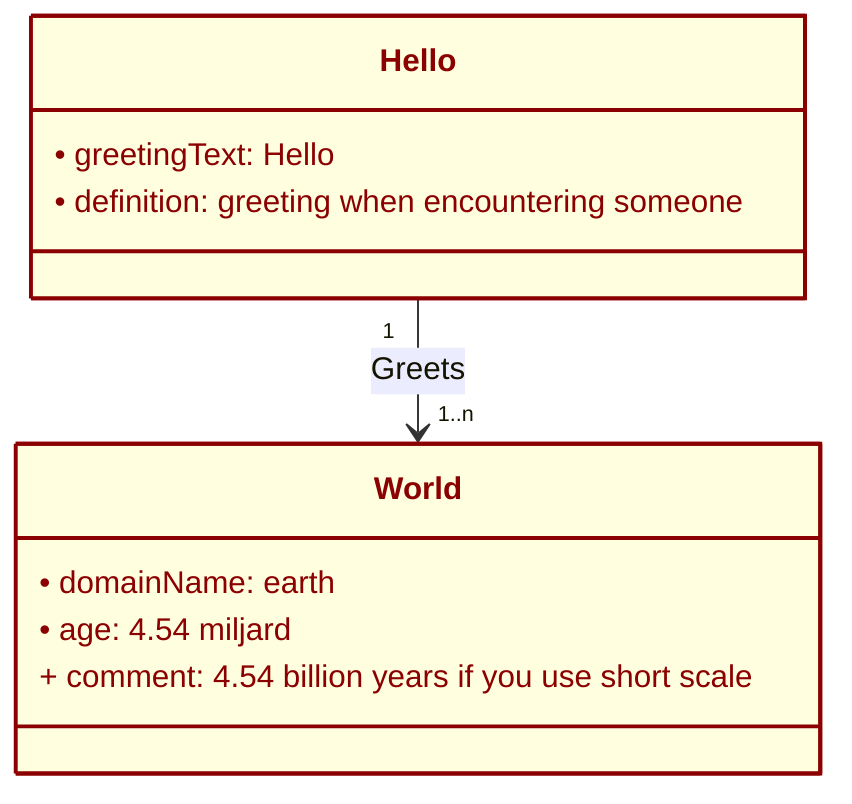

# Introduction

This is a template to collect information of every use case. The example used is the famous “Hello World”. For that I have to make a disclaimer:

It is an illustrative instance-level example of a class-level model that defines entities, attributes, and relations. The Hello World example is a simplified illustration used to explain class-attribute-relation modeling concepts. “Hello” and “World” represent example entities or classes, not literal data instances.

If you are so inclined, you can refactor it to an instance of the conceptual model. For instance:

    Classes:  Greeting and Audience.
    Relation:  Greeting greets Audience.
    Instances:  Hello (instance of Greeting).
    World (instance of Audience).
    Statement:  Hello greets World.

> **Important:** This template is on a "need" basis. If there is nothing to mention in the workflow part of the use case, for instance, just omit the paragraph. Only use what you need to. Keep it simple and clean.

# Use Case Overview of Hello World

Purpose: Capture the story and high-level purpose of the use case “Hello World”.

## Storyline

What is the scenario being solved? A fictional organization, Hello Authority, issues a simple attestation to a holder’s digital wallet.

This attestation confirms that Hello (the issuer entity) has a valid and verifiable connection with World (the subject entity).

The attestation’s only statement is:

“Hello greets World.”

## Business Context / Motivation

Why is this attestation needed?

The  _Hello World_  use case serves as a minimal, example to demonstrate how an attestation can represent structured information - including entities, attributes, relations, and lifecycle behaviors - within the EU wallet ecosystem (and beyond).

It helps modelers, developers, and policy stakeholders understand how semantics, trust, and lifecycle interact when designing and exchanging digital attestations.

## Stakeholders

issuer,
holder,
verifier,
relying party,
etc.

## Expected Outcome

What should happen when the attestation is used? By the end of the Hello World example, users of the template should understand:

1. How to describe an attestation using structured semantic elements (classes, attributes, relations).

2. If and if so how those elements are linked to trust, lifecycle, and interoperability concerns.

3. How to extend this structure to real-world use cases, e.g., ID, IBAN, or EUCC.

### Meta-purpose

The Hello World attestation is not about greeting the world - it’s about greeting the conceptual structure of attestations themselves. It provides a safe sandbox to explore what it means to model meaning.

# Data Model or Knowledge Graph

Purpose: Capture the entities, attributes, and relationships.

The Hello World data model is depicted below. It is a simple model to illustrate the use of data models to capture the use case entities.

Figure 1 "Hello World" exaple diagram or knoledge graph.

## Entity: Hello
|Name|Description/Definition|
|--|--|
| Hello | Represents the  _Hello_  part of  _Hello World_. It symbolizes the entity initiating a greeting. |

|Attribute| Description | mandatory | private | datatype | 
|--|--|--|--|--|
| greetingText | An example of a mandatory attribute that holds the text of the greeting. | yes | no | string |
| definition | An example of an optional, private attribute describing the greeting or its context. | no | yes | string |

| Relation | Description | Left Entity | Right Entity | Left Role | Right Role | Cardinality | Optional |
|--|--|--|--|--|--|--|--|
| greets | Expresses the relation between Hello (the greeter) and World (the greeted). | Hello | World | greeter | greeted | 1 1..n | no |

> Questions to ask per relation:
> Check whether the direction (Hello ? World) reflects the dominant
> flow of meaning.
> If both sides can have multiple relations (n?n), consider
> refactoring the relationship into a separate class (e.g.,
> GreetingEvent)

## Entity: World
|Name|Description/Definition|
|--|--|
| World | Represents the  _World_  part of  _Hello World_. It symbolizes the entity initiating a greeting. |

|Attribute| Description | mandatory | private | datatype | 
|--|--|--|--|--|
| domainName | A mandatory attribute representing the domain, context, or scope being greeted. | yes | no | string |
| age | An optional, private attribute showing example metadata about the World. | no | yes | string |

| Relation | Description | Left Entity | Right Entity | Left Role | Right Role | Cardinality | Optional |
|--|--|--|--|--|--|--|--|
| (none) | The World entity has no outgoing relations in this example. | - | - | - | - | - | - |

# Workflow of the Attestation

Purpose: Map the flow of actions, data, and interactions between entities.

| Actor | Role | Description |
|--|--|--|
| Hello Authority | issuer | The trusted party that creates and issues the Hello World attestation. It defines the semantics, attributes, and relation (“greets”) between the entities Hello and World. It also manages issuance, signing, and potential revocation. |
| Wallet Owner | holder | The user (or test persona) who receives the Hello World attestation in their EU Digital Identity Wallet. The holder stores, manages, and can present the attestation when needed. |
| EU business Wallet | Wallet | The technical component used by the holder to receive, store, and present the attestation. It handles workflow and format negotiation (JSON-LD, SD-JWT, mDoc) and enforces binding with the holder’s ID attestation. |
| Verifier | relying party | The entity that requests and verifies the Hello World attestation to confirm the claim “Hello greets World” is valid and trustworthy. It validates the signature, the wallet binding, and the issuer’s trust status. |
| Trust Registry | governance authority | Maintains the trust list or framework under which the Hello World issuer (Hello Authority) is recognized as trustworthy. It ensures that the attestation can be verified across systems and jurisdictions. |
| Attestation Registry | registry | Stores or indexes attestations for verification (if used in your architecture). |
| Revocation Service | revocation service | Manages lifecycle events, such as the deactivation of the Hello World attestation. |

Trigger Event: What initiates the workflow? a request from the holder’s wallet to obtain the “Hello World” attestation from the Hello Authority.

Post-condition: What is the result of the workflow? The holder’s wallet contains an active, verifiable Hello World attestation bound to the ID attestation.

See Figure 2 for a simplified overview.

![Swimlane 1](https://www.plantuml.com/plantuml/png/ZLJDaXet4BxhAReuh6SgIt6VpO-niIjR5SSkMDkLAYvQgHaKX3HfQMP2Ggho3dd3F4ca4R0C2snEZAJkhx_kxsjUEy_9rslDlF8QOV0ZQctXgoKjOUmzXdUlh85___u7tXavz7OOVcB0Qg5jEs3i5RorsX98N2YZOh23H-vGGaZRs9f0QEuSICLBucl6t4gPYeTFuCAhHlaD_Ca0tbYII0bhmcarHHbktrlZJ-_USB4goTP6ffUVLBdqlqJYBVlh2DvOZm7wQiB_Bzo3TgrQQsxm2lE7ED2hbLD8B7GsDy5Uvi29RDiHE8q9cdns-3JUEFfZrWwo0E6JM3aqYiDsBBobBJngArOk07HdLy0Crznu9U23bQYHRY5PP5pxfQM8djqxLoFbuSLg6ICcgbIUQ_ZAjKP_2r-Gr4B5bmUgdOSfbifvsepU1rRO1Y_TXhl6YkIr6LAZ1Dxs3BZFWSnMyOBhdB5jgWYZNIdus1gaBUjSpOe7KcM9L8Jat-g0D3V7_Xu0VyA_2s1zsbjMl5sYM46Re6_cvdu23TTAXgxlc5f0zYMUViZ1Bz50zgs8EXGx7RxVeCiPQeVFNepDMJ55W-tSF252e6qhXaQgHNXEb7VJBWdHkyGxKhsaGI3TSU8UWHB27Ii-4GQziTzlCLEbERwQcnjmw24UQmVVGOVPbNikJYXq7xSz5Fi3zoc4mfASc-m0COuMn3nYd1Cpe7pSgQatGDqjKe_dzMOdg0C-WUgelYZep5l2qwYzEo6RejueKy8dJduJuVSYL8GEpNvCcLt0uBakW_oyYQo9kV0D24BkiGUMn8d7cDkhVoob2rA5YHB23OGB3kkuZ36blr0mWiDATVITrGscwH3u67j9pcJslP9P4cuK8rSeHtFpxlTAKVYQrHMIGuaoFqFvi1Gm_dcoK__gVW0KOo6myZrLBgyDGEZgLnGdyMbfs2iO3eTmr5x5_H8opQEhi47ZynXnrLAfvJxy-Obzhf8uUxFlXdNM1LCKg9f3i5XoK-BTt7m8lKLZI3HncU3Uy6veBnXpLZ-ww4tZGKJT72ouqj1q6MB7ElsVl4OZwxN-3m00)
Figure 2 The swim lane diagram Hello World issuance and revocation.

Notable Interactions / Dependencies: Are there cross-border or cross-domain steps?

# Life Cycle of the Attestation

Purpose: Capture how the attestation evolves over time.

| Stage | Description |
|--|--|
| Creation / Issuance | Who issues it and under what conditions? The Hello Authority (trusted issuing entity). Preconditions: The holder’s wallet is activated and bound to a valid ID. |
| Usage / Presentation | How and where it’s presented? The attestation may be presented to any Verifier who requests proof that the Hello Authority issued a valid greeting (symbolically representing any verifiable claim). The wallet creates a verifiable presentation (potentially with selective disclosure). |
| Update / Renewal | Can it change or expire? The Hello World attestation is static by design - it has no mutable attributes. However, if either the schema changes or the Hello Authority updates its signing keys or trust policy, then a new version of the attestation must be issued. Optionally, an expiry date can be set to force periodic renewal for testing lifecycle behavior. |
| Revocation / Expiry | How is it invalidated or replaced? The Hello World attestation can be revoked by the issuer or automatically expire after a predefined validity period. |
| Archiving / End-of-life Handling | What happens after expiry or revocation? The wallet may retain a cryptographic proof of the attestation (hash or record) for audit or traceability purposes, while marking it as expired or revoked. The issuer may archive metadata (e.g., issuance date, revocation timestamp, format used) for audit trails, compliance testing, or statistical reporting complying to privacy rules. In demonstrative settings, archived attestations can serve as test material for verifying lifecycle management and revocation interoperability. |

# Requirements and Constraints

Purpose: Capture explicit and implicit technical or policy requirements.

## Information requirements

| No. | Requirement | Source | Verification method |
|--|--|--|--|
| I001 | The  _Hello World_  attestation shall serve as an illustrative reference implementation to clarify the intended use of this template and to demonstrate practical dilemmas and opportunities arising at the intersection of semantics, trust, lifecycle management, and real-world usage. While not intended as a production-grade attestation, it should support analysis and discussion of how these dimensions interact within the broader EU wallet ecosystem. | Bart Bink | inspect |

## Legal and Regulatory requirements
| No. | Requirement | Source | Verification method |
|--|--|--|--|
| L001 | The Hello World attestation is currently outside the scope of eIDAS2 compliance requirements. However, its design should not preclude future alignment with eIDAS2 trust frameworks, credential formats, or conformity assessment procedures. | eIDAS2 | review |

## Functional requirements
| No. | Requirement | Source | Verification method |
|--|--|--|--|
| F001 | The Hello World attestation shall be capable of being issued to any compliant digital wallet, irrespective of the wallet provider or implementation, provided that the wallet supports at least one of the supported attestation formats (JSON-LD, SD-JWT, or mDoc). The attestation should not rely on wallet-specific extensions or proprietary interfaces that would limit its interoperability. | Bart Bink | test |

## Technical requirements – e.g. security, privacy, performance, usability.
| No. | Requirement | Source | Verification method |
|--|--|--|--|
| T001 | The issuer MUST issue the Hello World attestation as a JSON-LD-based attestation. If the recipient wallet does not support JSON-LD, the issuer MUST fall back to an SD-JWT-based attestation. If the recipient wallet does not support SD-JWT, the issuer MUST issue the attestation as an mDoc. | WEBUILD Semantic Modeling interoperability requirement. | test |

## Operational requirements
| No. | Requirement | Source | Verification method |
|--|--|--|--|
| O001 | The  _Hello World_  attestation shall be automatically reactivated/reissued whenever the user’s associated digital identity attestation is renewed or replaced, in order to maintain a valid binding between the attestation and the user’s active eWallet identity. If the recipient wallet does not support SD-JWT, the issuer MUST issue the attestation as an mDoc. | WEBUILD Semantic Modeling interoperability requirement. | test |

## Governance and trust restrictions
| No. | Requirement | Source | Verification method |
|--|--|--|--|
| G001 | The  _Hello World_  attestation shall be cryptographically bound to both the holder’s eWallet and the holder’s verified identity attestation to ensure authenticity and non-transferability.| General trust mechanism. | review |

## Open Questions / Gaps – For follow-up or design iterations.
| No. | Question | Why |
|--|--|--|
| Q001 | How should the  _Hello World_  attestation’s semantics — including its entities, attributes, and relationships — be aligned with existing vocabularies or ontologies to ensure that other ecosystems or wallet implementations can interpret its meaning consistently?| Where does the authoritative meaning of each attribute come from, and how stable must that be? |
| Q002 | Which core entities and attributes in the  _Hello World_  attestation should be represented as references to existing EU or W3C vocabularies, and which—if any—require the definition of new, domain-specific terms? | **Information model:** _semantic reuse vs. semantic innovation,_ ensuring interoperability while avoiding redundancy.
| Q003 | How can we semantically represent the lifecycle states of the  _Hello World_ attestation (e.g., issued, active, revoked, superseded) so that they are machine-interpretable and consistent across issuers and verifiers? | **Lyfe Cycle:** _Lifecycle concepts are often procedural in code_ but implicit in meaning. Defining them semantically enables automation, policy reasoning, and consistent interpretation across ecosystems (outside of the eWallet ecosystem too). |
| Q004 | What is the most appropriate way to semantically express the binding between the  _Hello World_  attestation, the holder’s identity, and the wallet instance, so that trust can be verified across different infrastructures and trust frameworks? Or is this outside the semantics and part of the meta data in the attestation? | **Trust semantics:** This is about semantic binding—how trust relationships are described and validated, not just cryptographically but meaningfully. It connects the modeling work to governance and policy semantics (who asserts what, on whose behalf, and under which trust framework). |
