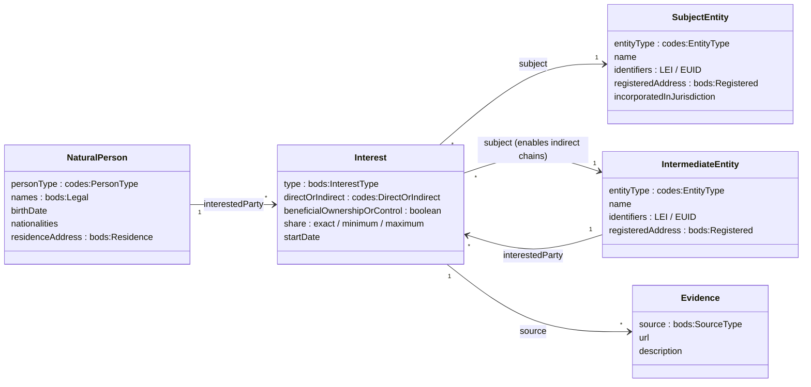
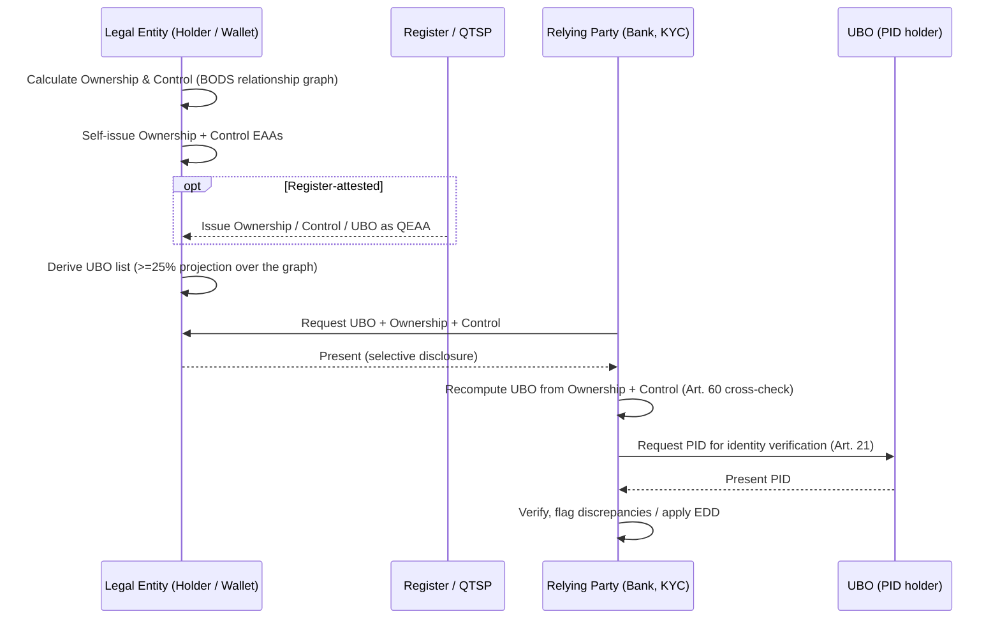

<!--
  Semantic Intake submission — instantiates wp4-semantics-group/Semantic_Intake_template.md
  Use case: Beneficial Ownership (Ownership, Control & UBO)
  Suggested location: a new file under the semantics repo (e.g. test-drafts/ or a use-cases/ folder),
  or pasted into the group's intake process.
  This submission is also intended to answer open questions Q001/Q002 in the template
  (semantic reuse vs. semantic innovation) for this use case.
-->

# Introduction

This document instantiates the WE BUILD Semantic Intake template for the **beneficial-ownership** use case — the family of three closely related attestations covered by `rb-ownership`, `rb-control` and `rb-ubo`. It is a class-level model (entities, attributes, relations), and it deliberately anchors each element to the **Beneficial Ownership Data Standard (BODS) RDF Vocabulary** (`bods:` = `https://vocab.openownership.org/terms#`, `codes:` = `https://standard.openownership.org/codelists#`), reusing existing EBW Vocabulary terms (`ebwv:` = `https://w3id.org/ebwv#`) for shared identity attributes.

The three attestations are one underlying model viewed three ways: Ownership and Control are the source relationship graph; the UBO list is a derived projection over that graph (the natural persons meeting the ≥25% ownership / control threshold). BODS represents exactly this — a graph of immutable statements about subjects, with the UBO view as a query over it — which is why it is proposed here as the reference model.

# Use Case Overview of Beneficial Ownership (Ownership, Control & UBO)

Purpose: Capture the story and high-level purpose of the beneficial-ownership use case.

## Storyline

A legal entity needs to disclose, in verifiable form, the natural persons who ultimately own or control it. It assembles two source attestations — an **Ownership** attestation (who holds direct/indirect economic interests) and a **Control** attestation (who exercises effective control, by whatever mechanism) — and from these derives a **UBO** attestation listing the natural persons above the ≥25% ownership/control threshold (or controlling by other means), as required by AMLR Article 3(17).

These attestations are issued into the entity's company wallet — self-issued as Electronic Attestations of Attributes (EAA), or issued by a national Transparency Register / QTSP as Qualified EAAs (QEAA). A relying party (typically a bank during corporate-account KYC, or a buyer during supplier onboarding/KYS) requests them, independently recomputes the UBO set from the Ownership and Control lists (the AMLR Article 60 discrepancy cross-check), and verifies each UBO's identity against a Person Identification Data (PID) attestation.

## Business Context / Motivation

Identifying who ultimately owns or controls a legal entity is a foundational requirement of EU anti-money-laundering and counter-terrorist-financing law (Regulation (EU) 2024/1624 — AMLR, Articles 3(17), 20–25, 60, 62; the predecessor AMLD framework; and the proposed Implementing Act on formats for submitting beneficial-ownership information). Today this information is exchanged as unstructured documents and re-keyed at every step. A verifiable, machine-interpretable, *semantically anchored* attestation lets the same ownership facts flow — without re-keying — from the company, to obliged entities for KYC/KYS, to national Transparency Registers, and back for cross-checking.

The semantic anchoring is the point of this submission. Without an agreed vocabulary, "25% ownership" or "control via nominee" mean whatever each issuer decides, and interoperability fails at the meaning layer even when the credential format is shared.

## Stakeholders

- **Issuer** — the legal entity itself (self-issued EAA), or a national Transparency Register / competent authority / QTSP (QEAA).
- **Holder** — the legal entity, via its company wallet (EU Business Wallet).
- **Verifier / Relying Party** — obliged entities performing KYC (banks, financial institutions) or KYS (procuring entities, suppliers).
- **Subject** — the legal entity whose ownership/control is described; and, for the UBO list, each natural person UBO.
- **Transparency Register / Beneficial Ownership Register** — the AMLR Article 60 register; consumer of submissions and authority for discrepancy reporting.
- **Trust Registry / governance authority** — maintains the trust list under which issuers are recognised.
- **Revocation / status service** — manages credential lifecycle (status list).

## Expected Outcome

When the attestations are used, a relying party can: (1) read a structured, selectively disclosable statement of ownership, control and UBOs; (2) independently recompute the UBO set from the ownership and control graph and detect discrepancies; (3) verify each UBO's identity via PID; and (4) losslessly convert the ownership/control claims to a BODS statement for register submission (AMLR Art. 60/62) and onward analysis — and back.

By the end, modellers and implementers should understand which attributes reuse existing EU/W3C vocabulary, which reuse BODS, and which (if any) require new EBW terms.

### Meta-purpose

This use case is the natural test of the template's Q001/Q002 ("semantic reuse vs. semantic innovation"). It is rich enough to exercise real reuse — shared identity attributes from existing vocabulary, the full ownership/control interest model from BODS — while exposing the few genuine gaps (e.g. partnership interests) where new terms or upstream proposals may be needed.

# Data Model or Knowledge Graph

Purpose: Capture the entities, attributes, and relationships.

The model mirrors the three BODS statement types: a **Subject Entity** (entity statement), an **Interested Party** that is either a **Natural Person** (person statement) or an **Intermediate Entity** (entity statement), and an **Interest** linking them (relationship statement, carrying one or more typed interests). The Interest's subject may itself be an Intermediate Entity, which is how indirect ownership chains are represented.

*Figure 1 — Beneficial-ownership data model, aligned to the three BODS statement types. The UBO list is a derived view: the set of `NaturalPerson` nodes whose aggregated interests meet the ≥25% threshold or constitute control by other means.*

**Entity: SubjectEntity** — the legal entity whose ownership/control is declared.

| Name | Description/Definition |
|--|--|
| SubjectEntity | The legal entity subject to the ownership/control/UBO disclosure. BODS *entity statement*. |

| Attribute | Description | mandatory | private | datatype | Semantic reference (reuse → BODS) |
|--|--|--|--|--|--|
| entityType | Kind of entity (registered entity, legal entity, arrangement, state body…) | yes | no | enum | BODS `entityType.type` → `codes:RegisteredEntity` / `codes:LegalEntity` / `codes:Arrangement` / `codes:State` / `codes:StateBody` |
| name | Legal name of the entity | yes | no | string | `ebwv:legalName` ; BODS entity `name` |
| legalForm | Legal form (e.g. GmbH, SA, BV) | no | no | string | `ebwv:legalForm` |
| identifiers | LEI and/or EUID and other registry identifiers | yes | no | array | `ebwv:lei` / `ebwv:legalIdentifier` (`ebwv:Euid`) ; BODS `identifiers[]` {`id`, `scheme`, `schemeName`} |
| registeredAddress | Official registered address | yes | no | object | `ebwv:registeredAddress` ; BODS address type `bods:Registered` |
| incorporatedInJurisdiction | Jurisdiction of incorporation | no | no | object | `ebwv:jurisdiction` ; BODS `incorporatedInJurisdiction` {`name`, `code`} |

| Relation | Description | Left Entity | Right Entity | Left Role | Right Role | Cardinality | Optional |
|--|--|--|--|--|--|--|--|
| is subject of | The entity is the subject of one or more ownership/control interests | SubjectEntity | Interest | subject | — | 1 → 0..n | no |

**Entity: NaturalPerson** — a UBO, shareholder or controller.

| Name | Description/Definition |
|--|--|
| NaturalPerson | A natural person holding an ownership or control interest. BODS *person statement*. |

| Attribute | Description | mandatory | private | datatype | Semantic reference (reuse → BODS) |
|--|--|--|--|--|--|
| personType | Known / anonymous / unknown person | yes | no | enum | BODS `personType` → `codes:KnownPerson` / `codes:AnonymousPerson` / `codes:UnknownPerson` |
| given_name | First name(s) | yes | yes | string | `ebwv:givenName` ; BODS `names[].fullName` (type `bods:Legal`) |
| family_name | Surname(s) | yes | yes | string | `ebwv:familyName` ; BODS `names[]` (type `bods:Legal`) |
| birth_date | Date of birth | yes | yes | date | `ebwv:dateOfBirth` ; BODS `birthDate` |
| birthplace | Locality + country of birth | yes | yes | object | `ebwv:placeOfBirth` ; BODS address type `bods:PlaceOfBirth` |
| nationalities | Citizenship(s) | yes | yes | array | `ebwv:citizenship` ; BODS `nationalities[]` {`code`, `name`} |
| residence_address | Residential address | yes | yes | object | `ebwv:domicile` ; BODS address type `bods:Residence` |
| identity document | Passport / national ID for identity verification | yes | yes | object | Supplied via the **PID** attestation (`rb-pid`) rather than carried here — matches the Step-1 PID verification flow |

| Relation | Description | Left Entity | Right Entity | Left Role | Right Role | Cardinality | Optional |
|--|--|--|--|--|--|--|--|
| holds interest | The person holds an ownership/control interest in the subject | NaturalPerson | Interest | interestedParty | — | 1 → 0..n | no |

**Entity: IntermediateEntity** — an entity in an indirect ownership chain.

| Name | Description/Definition |
|--|--|
| IntermediateEntity | A legal entity through which ownership/control is held indirectly. BODS *entity statement*; identical shape to SubjectEntity. It is simultaneously the interestedParty of one interest and the subject of others — this is how chains are expressed. |

| Attribute | Description | mandatory | private | datatype | Semantic reference (reuse → BODS) |
|--|--|--|--|--|--|
| (as SubjectEntity) | Same attribute set as SubjectEntity | — | — | — | As above |

| Relation | Description | Left Entity | Right Entity | Left Role | Right Role | Cardinality | Optional |
|--|--|--|--|--|--|--|--|
| holds interest | Holds an interest in a downstream entity | IntermediateEntity | Interest | interestedParty | — | 1 → 0..n | no |
| is subject of | Is itself the subject of upstream interests | IntermediateEntity | Interest | subject | — | 1 → 0..n | no |

**Entity: Interest** — the ownership-or-control relationship (the core of the model).

| Name | Description/Definition |
|--|--|
| Interest | A typed ownership or control interest between an interested party and a subject entity. BODS *relationship statement*, carrying one or more entries in `interests[]`. |

| Attribute | Description | mandatory | private | datatype | Semantic reference (reuse → BODS) |
|--|--|--|--|--|--|
| type | Nature of the interest (shareholding, voting rights, board appointment, nominee, trustee…) | yes | no | enum | BODS `interests[].type` → `bods:InterestType` (see crosswalk: `bods:Shareholding`, `bods:VotingRights`, `bods:AppointmentOfBoard`, `bods:SeniorManagingOfficial`, `bods:Nominee`, `bods:Trustee`, `bods:OtherInfluenceOrControl`, …) |
| directOrIndirect | Whether held directly or via intermediates | yes | no | enum | BODS `interests[].directOrIndirect` → `codes:Direct` / `codes:Indirect` / `codes:Unknown` |
| beneficialOwnershipOrControl | Whether this interest constitutes beneficial ownership/control | yes | no | boolean | BODS `interests[].beneficialOwnershipOrControl` |
| share | Percentage held — exact or a band | yes | no | object | BODS `interests[].share` {`exact` \| `minimum`/`maximum` \| `exclusiveMinimum`/`exclusiveMaximum`} |
| startDate / endDate | Period the interest is/was held | no | no | date | BODS `interests[].startDate` / `endDate` |

| Relation | Description | Left Entity | Right Entity | Left Role | Right Role | Cardinality | Optional |
|--|--|--|--|--|--|--|--|
| in (subject) | The entity the interest is held in | Interest | SubjectEntity / IntermediateEntity | — | subject | 0..n → 1 | no |
| by (interested party) | The party holding the interest | Interest | NaturalPerson / IntermediateEntity | — | interestedParty | 0..n → 1 | no |

> Per the template's relation questions: the dominant flow of meaning is *interested party → subject*. Because both sides can be multiple and an entity can play both roles, the relationship is correctly modelled as its own class (the BODS relationship statement), not as an attribute on either party — which is precisely the gap in the current rulebooks, where stake is an attribute hanging off the person.

# Workflow of the Attestation

Purpose: Map the flow of actions, data, and interactions between entities.

| Actor | Role | Description |
|--|--|--|
| Legal Entity | issuer (EAA) / holder | Calculates its ownership and control graph; self-issues Ownership and Control attestations; derives the UBO list; stores all three in its company wallet. |
| Transparency Register / QTSP | issuer (QEAA) | Optionally issues Ownership/Control/UBO as qualified attestations, certifying the calculation. |
| Company Wallet | wallet | Receives, stores and selectively discloses the attestations; enforces holder binding. |
| Relying Party (e.g. bank) | verifier | Requests the attestations; recomputes the UBO set from Ownership + Control (Art. 60 cross-check); verifies UBO identity via PID; handles discrepancies / applies EDD. |
| UBO | subject / PID holder | Presents a PID attestation for identity verification. |
| Trust Registry | governance authority | Establishes issuer trust status. |
| Revocation / Status Service | revocation service | Publishes credential status (revoked / active). |

**Trigger Event:** A relying party's request for ownership/control/UBO information during KYC (corporate-account opening) or KYS (supplier onboarding); or a regulatory obligation to submit to a Transparency Register.

**Post-condition:** The relying party holds verified, structured ownership/control/UBO data, has reconciled it against an independent calculation, and (where required) has submitted a BODS-conformant record to the register.

*Figure 2 — Issuance, presentation, cross-check and identity-verification flow.*

**Notable Interactions / Dependencies:** Cross-border (the entity, its UBOs, intermediate entities and the relying party may sit in different jurisdictions — hence ISO 3166 country codes and the EUID/LEI identifier backbone); cross-domain (the same ownership facts must round-trip between the wallet/credential domain and the register/BODS domain).

# Life Cycle of the Attestation

Purpose: Capture how the attestation evolves over time. Two lifecycles operate in parallel and must not be conflated: the **credential** lifecycle (the VC envelope) and the **ownership-fact** lifecycle (the data). BODS handles the latter natively.

| Stage | Description |
|--|--|
| Creation / Issuance | The legal entity (EAA) or register/QTSP (QEAA) issues the attestation once the ownership/control calculation is complete and the wallet is bound to a valid identity. In BODS terms, each fact is a statement with `statementDate` and `recordStatus: new`. |
| Usage / Presentation | Presented to relying parties with selective disclosure (SD-JWT VC). The relying party may request all three attestations to perform the Art. 60 cross-check. |
| Update / Renewal | When ownership or control changes, the entity re-issues. The *credential* gets a new validity period; the *fact* is expressed in BODS as a new statement with the same `recordId` and `recordStatus: updated`, preserving history (append-only). The UBO list is re-derived. |
| Revocation / Expiry | The *credential* is revoked or expires via the status-list mechanism (`status` claim). This is distinct from a *fact* ceasing to hold, which BODS expresses with `recordStatus: closed`. |
| Archiving / End-of-life | Prior credentials may be retained as cryptographic proof; prior BODS statements remain in the record's history for audit and for reconstructing ownership as at any past date. |

# Requirements and Constraints

Purpose: Capture explicit and implicit technical or policy requirements.

## Information requirements

| No. | Requirement | Source | Verification method |
|--|--|--|--|
| I001 | Each UBO SHALL carry the AMLR Art. 62 mandatory attributes (name, place and full date of birth, residential address, country/countries of residence, nationality, nature/extent of interest). | AMLR Art. 62 | inspect |
| I002 | The nature of each interest SHALL be expressed using a controlled vocabulary, proposed here as `bods:InterestType`. | This submission / BODS | inspect |
| I003 | Ownership percentages SHALL be expressible as an exact value or a band (min/max), to match register and Implementing-Act formats. | Proposed EU Implementing Act on BO formats; BODS `share` | inspect |
| I004 | Indirect ownership SHALL be traceable through intermediate entities, not collapsed into a single total. | AMLR Art. 3(17); BODS relationship model | review |

## Legal and Regulatory requirements

| No. | Requirement | Source | Verification method |
|--|--|--|--|
| L001 | The model SHALL support AMLR definitions of beneficial owner and the ≥25% threshold. | Regulation (EU) 2024/1624, Art. 3(17) | review |
| L002 | The model SHALL support submission to, and discrepancy reporting with, national Transparency Registers. | AMLR Art. 60 | review |
| L003 | Personal data (residential addresses, DOB, nationality) SHALL be minimised and selectively disclosable. | GDPR; eIDAS2 / SD-JWT VC selective disclosure | review |
| L004 | The design SHALL remain compatible with the EU Implementing Act on formats for submitting beneficial-ownership information. | Proposed Implementing Act (formats) | review |

## Functional requirements

| No. | Requirement | Source | Verification method |
|--|--|--|--|
| F001 | Ownership/control claims SHALL round-trip losslessly to a BODS statement and back. | This submission / BODS 0.4 | test |
| F002 | A relying party SHALL be able to recompute the UBO set from the Ownership and Control attestations. | AMLR Art. 60; `rb-ubo` §4.2.10 | test |
| F003 | The UBO list SHALL be representable as a derived projection over the ownership/control graph, not a parallel source of truth. | This submission | review |

## Technical requirements – e.g. security, privacy, performance, usability.

| No. | Requirement | Source | Verification method |
|--|--|--|--|
| T001 | Attribute-level selective disclosure SHALL be supported (SD-JWT VC). | `rb-ubo`/`rb-ownership`/`rb-control` §3.2 | test |
| T002 | Each enumerated value SHALL resolve to a dereferenceable IRI (`bods:` / `codes:` / `ebwv:`). | This submission | test |
| T003 | Entity identification SHALL use a consistent identifier scheme set (LEI, EUID) expressed as BODS `identifiers` {`scheme`, `schemeName`}. | GLEIF / EUID; BODS | test |

## Operational requirements

| No. | Requirement | Source | Verification method |
|--|--|--|--|
| O001 | A change in ownership/control SHALL trigger re-issuance and re-derivation of the UBO list. | AMLR ongoing-monitoring (Art. 25) | test |
| O002 | Historical ownership states SHALL be reconstructable (append-only fact history). | BODS `recordStatus` / `statementDate` | review |

## Governance and trust restrictions

| No. | Requirement | Source | Verification method |
|--|--|--|--|
| G001 | The attestation's legal category (EAA self-issued vs QEAA register/QTSP-issued) SHALL be explicit. | eIDAS2; rulebooks §2 | review |
| G002 | Provenance of each fact SHALL be recordable (official register / self-declaration / third party). | BODS `source.type` → `bods:OfficialRegister` / `bods:SelfDeclaration` / `bods:ThirdParty` | review |

## Open Questions / Gaps – For follow-up or design iterations.

| No. | Question | Why |
|--|--|--|
| Q-BO-001 | Adopt BODS as the reference model for the interest/ownership/control semantics, reuse existing `ebwv:` terms for shared identity attributes (person, entity, address, identifier), and define any new EBW interest terms as `ebwv:` classes aligned to BODS via `owl:equivalentClass` / `skos:closeMatch`? | This is the direct answer to template Q001/Q002 (semantic reuse vs. innovation) for this use case. |
| Q-BO-002 | "Partner in partnership structures" has no exact BODS interest type. Model via entity type `codes:Arrangement` plus a shareholding-equivalent interest, or raise an upstream BODS proposal? | A genuine gap — needs a decision and possibly coordination with Open Ownership. |
| Q-BO-003 | Reconcile the rulebooks' single-decimal `stake` (25.0–100.0) with BODS `share` as a band. EU register formats use bands. | Affects conformance with the Implementing Act and with real register data. |
| Q-BO-004 | Represent the derived UBO list as a projection/annotation over the ownership/control graph rather than a third independent dataset? | Avoids three parallel sources of truth drifting apart; matches the Art. 60 cross-check intent. |
| Q-BO-005 | "Acting in concert" / family control collapses to `bods:OtherInfluenceOrControl`, losing granularity. Accept, or capture detail in an annotation? | Trade-off between vocabulary simplicity and disclosure fidelity. |
| Q-BO-006 | Standardise EUID and LEI as BODS identifier schemes ({`scheme`, `schemeName`}) across the EBW model. | Aligns the entity-identifier backbone; GODIN/GLEIF can help define the scheme list. |
| Q-BO-007 | Keep the credential lifecycle (status list) and the ownership-fact lifecycle (BODS `recordStatus`) cleanly separated so state is not double-encoded. | Conflating them causes ambiguity about whether a fact changed or a credential was merely reissued. |
